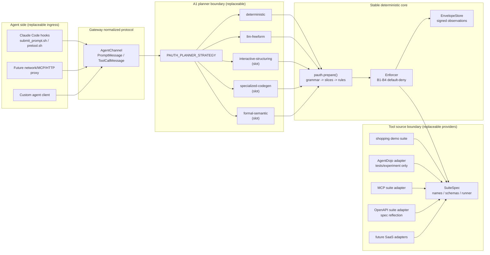
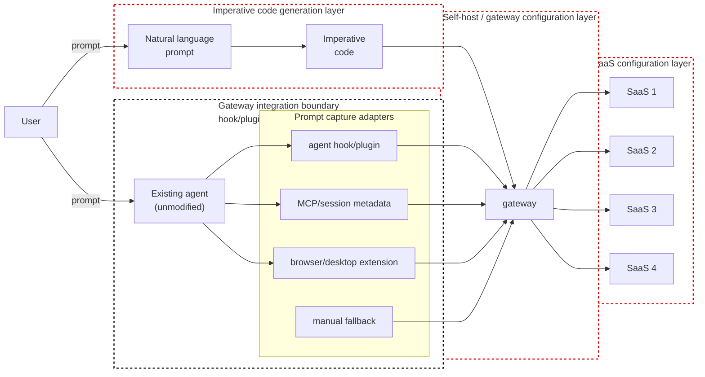

# architecture

PAuth ベースの、改変なしエージェント向け task-scoped authorization gateway
（Claude Code が最初のターゲット）。本ドキュメントは、`pauth/`・`gateway/`・
`tests/` の実装が体現するシステムレベルの設計を記述する。意思決定の経緯は
`grill.md` にある。現状の設計ステータス、未着手の実装アイデア、棄却された主張、
開発上のボトルネックは `gateway/DESIGN_STATUS.md` に分離してある。

## 1. System overview

```
       ┌──────────┐
       │   USER   │
       └────┬─────┘
            │ types prompt
            ▼
   ┌─────────────────────────────────────────────────────────────────┐
   │                       Claude Code (UNMODIFIED)                  │
   │                                                                 │
   │   ┌──────────────────┐                  ┌────────────────────┐  │
   │   │ UserPromptSubmit │ ─── hook ───────►│ submit_prompt.sh   │  │
   │   │  (harness event) │                  └──────────┬─────────┘  │
   │   └──────────────────┘                             │            │
   │            │                                       │ HTTP POST  │
   │            ▼ LLM reasoning                         ▼            │
   │   ┌──────────────────┐                  ┌────────────────────┐  │
   │   │  tool decision   │ ─── hook ───────►│ pretool.sh         │  │
   │   │  (PreToolUse)    │                  └──────────┬─────────┘  │
   │   └──────────────────┘                             │            │
   │                                                    │ HTTP POST  │
   └────────────────────────────────────────────────────┼────────────┘
                                                        ▼
   ┌─────────────────────────────────────────────────────────────────┐
   │              gateway/serving/http_server.py  (long-running daemon)      │
   │                                                                 │
   │   POST /sessions/<id>/messages   -- prompt OR tool_call         │
   │                                                                 │
   │            ┌─────────────────────────────────────────────┐      │
   │            │            gateway.AgentChannel             │      │
   │            │  - one channel per Claude Code session_id   │      │
   │            │  - enforces "prompt first, exactly once"    │      │
   │            └────────────────────┬────────────────────────┘      │
   │                                 │                               │
   │                                 ▼                               │
   │            ┌─────────────────────────────────────────────┐      │
   │            │           gateway.Gateway                   │      │
   │            │  submit_user_prompt(prompt)     plan ONCE   │      │
   │            │  handle_tool_call(tool, args)   enforce ALL │      │
   │            └────────┬────────────────────────┬───────────┘      │
   │                     │ A1 → A2 → A3           │ B1 – B4          │
   │                     ▼                        ▼                  │
   │            ┌────────────────┐       ┌───────────────────┐       │
   │            │  pauth library │       │ suite runner      │       │
   │            │  (algorithm)   │       │ (real tool exec)  │       │
   │            └────────────────┘       └─────────┬─────────┘       │
   │                                               │                 │
   └───────────────────────────────────────────────┼─────────────────┘
                                                   │ real call
                                                   ▼
                                  ┌─────────────────────────────────┐
                                  │ SaaS / external system          │
                                  │ (shopping demo today;           │
                                  │  banking / slack / gmail / etc. │
                                  │  via per-user registration      │
                                  │  later)                         │
                                  └─────────────────────────────────┘
```

## 1.1 Loose-coupling map

gateway は安定したまま、変化の激しい3つの領域が動くようにすべきである:

1. エージェントのトラフィックがどう gateway に入ってくるか;
2. user prompt がどう制限付き命令型コードになるか;
3. どの実アプリ / mock suite / SaaS backend がツールを提供するか。

これらの領域は、小さな契約によって意図的に分離されている。



### Coupling boundaries

| Boundary | Contract | Replaceable parts | Stable owner |
|---|---|---|---|
| Agent ingress | `PromptMessage` と `ToolCallMessage` | Claude hooks、将来の MCP/HTTP proxy、custom client | `gateway/ingress/agent_channel.py` |
| Planner | 制限付き命令型の `def run(...): ...` | deterministic recognizer、LLM free-form、interactive structuring、specialized model、formal parser | `gateway/planning/planner.py` |
| Tool source | `SuiteSpec`（`tools`, `make_env`, `runner_factory`） | shopping demo、AgentDojo、MCP servers、OpenAPI specs、将来の SaaS adapters | `pauth/suites/base.py` |
| Authorization core | コンパイル済みルール + envelope 裏付けの operand チェック | provider ごとに変わるべきではない | `pauth/` |

**用語注 — ここでの "ingress" は *adapter* レベルのみを指す。** このマップでの
"Agent ingress" は、*どの adapter* がエージェントを接続するか（hooks / proxy /
custom client）を指し、それらはすべて `PromptMessage` / `ToolCallMessage` へと
正規化される。これはワイヤレベルでの捕捉 vs 強制の方向を**記述するものではない**。
往復区間モデル（往路/復路 × ingress/egress — どこで prompt が観測され、どこで
tool call が観測され、強制が作用できる唯一の区間はどこか）は
`gateway/INGRESS_DESIGN.md` の "Directional model" で定義されている。この2つの
語彙は区別して保つこと: 本ドキュメントの "ingress" = adapter、あちらのドキュメントの
復路egress = enforcement tap。これらは同義語ではない。

AgentDojo は **Tool source** 境界の背後に属する。それはベンチマークと mock 環境
で使われる provider であって、アーキテクチャの中心ではない。実アプリが AgentDojo
を置き換えるなら、それらは `SuiteSpec` を実装するか、それに adapt すべきである;
PAuth core と planner 契約は、裏側のツールが AgentDojo・MCP・OpenAPI・手書きの
suite のどれ由来かを知るべきではない。

OpenAPI 裏付けの provider は、もう1つの運用ループを加える: `gateway/providers/openapi_suite.py`
はロード時に spec を reflect し、`gateway/providers/api_spec_monitor.py` は spec の
変更を検知して notification-ready な diff を出す。gateway は、変化したツール表面を
ユーザーに surface することなく、upstream の API 変更を黙って吸収すべきではない。

## 1.2 Reference mental model

これはユーザーの白背景スケッチ（`cloud local.pdf`、2026-06-09 に共有）に由来する
作業用メンタルモデルである。今後の設計議論では、これら3つの赤点線ゾーンを分離して
保つこと。



解釈:

| Red-dotted zone | 意味 | 現リポジトリでのアンカー |
|---|---|---|
| Imperative code generation layer | 未解決の A1 問題: 自然言語から制限付き `run()` コードへ。 | `gateway/planning/planner.py`, `gateway/PLANNING_STRATEGIES.md`, `pauth/codegen.py`, `gateway/planning/agentic_a1.py` |
| Self-host / gateway configuration layer | ユーザーが gateway をどう実行/設定し、planner strategy を選び、session を管理し、変更された spec をリロードし、audit/notification 出力を受け取るか。 | `gateway/serving/http_server.py`, `gateway/serving/config.py`, `gateway/SELF_HOSTING.md`, `gateway/providers/api_spec_monitor.py` |
| SaaS configuration layer | 実アプリ/SaaS API がどう登録され、reflect され、monitor され、`SuiteSpec` へ adapt されるか。 | `pauth/suites/base.py`, `gateway/providers/mcp_suite.py`, `gateway/providers/openapi_suite.py`, `gateway/providers/registry.py` |

既存エージェントを囲む黒点線ゾーンは、gateway integration boundary を表す:
ライフサイクル hook/plugin がクリーンな prompt と試みられた tool call を転送し、
一方で network/tool routing が bypass を防ぐ。既存エージェントそのものは意図的に
赤の設計ゾーンの外にある。製品上のゴールは、セットアップ後はエージェントの
ランタイムと日常のユーザーワークフローを改変なしに保ちつつ、可変性を gateway
ingress・planner strategy・tool-source adapters に移すことである。（ここでの
"ingress" = adapter レベル; ワイヤレベルの 往路/復路 × ingress/egress 区間モデル
については `gateway/INGRESS_DESIGN.md` の "Directional model" を参照。）

Prompt capture は adapter ベースである。エージェントごとに公開する信号は異なるが、
あらゆる capture 経路は `AgentChannel` に到達する前に `PromptMessage` へ正規化
されなければならない。設計のターゲットは1つの普遍的な prompt hook ではなく、1つの
普遍的な prompt event 契約である。

## 2. Component responsibilities

| Component | 責務 |
|---|---|
| `pauth/` | 純粋な PAuth アルゴリズム。`codegen`（A1 LLM prompt）、`grammar`（Appendix A parser）、`slicing`（A2）、`rules`（A3, Algorithm 1）、`enforcer`（B1–B4）、`envelope`（signed observations）、`evaluator`（決定的な記号評価）、`suites/base`（SuiteSpec インターフェイス）。エージェント・hook・HTTP の知識を持たない。 |
| `pauth/suites/shopping.py` | 自己完結した demo suite: tools、environment、runner、および worked-example のリファレンスコード / task 定義。論文再現（`tests/`）と gateway demo の両方で使われる。 |
| `gateway/planning/core.py` | NL → run() recognizer（決定的、regex 駆動）。strict path でのみ使われる; agentic/freeform path はこれをスキップする。 |
| `gateway/planning/planner.py` | プラグ可能な A1 境界。planner strategy が制限付き命令型コードを emit し、`Gateway` がそれを安定した PAuth パイプライン経由でコンパイル・強制する。 |
| `gateway/PLANNING_STRATEGIES.md` | A1 strategy カタログ: interactive structuring、specialized な命令型コードモデル、formal NL 解析。 |
| `gateway/planning/agentic_a1.py` | grammar-feedback ループ付きの LLM A1（Q12）。`pauth.codegen.SYSTEM_PROMPT` をラップし、`RestrictedGrammarError` を catch し、違反したルールを LLM にフィードバックし、最大 N 回リトライする。 |
| `gateway/runtime/gateway.py` | `Gateway` クラス。1つの task lifecycle を保持する。2つのエントリポイント: `submit_user_prompt(prompt)`（plan once）と `handle_tool_call(tool, args)`（call ごとに enforce）。 |
| `gateway/ingress/agent_channel.py` | エージェント向け API。2種類のメッセージ: `prompt` と `tool_call`。"prompt first, exactly once" を構造的に強制する。JSON シリアライズ可能なワイヤ形状。 |
| `gateway/serving/http_server.py` | 最小限の stdlib HTTP ラッパー。`POST /sessions/<id>/messages`。session はクライアント供給の id（Claude Code の session_id）でキー付けされる。 |
| `gateway/hooks/` | `submit_prompt.sh`（UserPromptSubmit）と `pretool.sh`（PreToolUse）。それぞれ strict / log モードを持つ、薄い curl-to-HTTP shim。 |
| `tests/` | 論文再現（`tests/test_worked_examples.py`, `tests/test_unexpected_attacks.py`, `tests/experiment/`）と L1/L2/L3 fixtures（`tests/fixtures/`）。 |

## 3. Data flow (one task lifecycle)

```
                    User prompt
                         │
        (1) UserPromptSubmit hook fires before the LLM sees the prompt
                         │
                         ▼
                 HTTP /sessions/<id>/messages
                 { "kind": "prompt", "prompt": "..." }
                         │
            ┌────────────┴───────────┐
            │ AgentChannel.receive   │
            │  - first prompt? OK    │
            │  - second prompt? ERR  │
            └────────────┬───────────┘
                         │
                         ▼
         Gateway.submit_user_prompt(prompt)
                         │
            ┌────────────┴────────────┐
            │ gateway.planner         │
            │  - deterministic        │   strict path
            │    recognizer           │
            │  - agentic LLM + repair │   freeform path
            │  - future planner       │   self-hosted app
            └────────────┬────────────┘
                         │
                         ▼
              pauth.prepare(code)
              ├─ grammar.parse_and_validate
              ├─ slicing.derive_slices     (A2)
              └─ rules.compile_rules       (A3)
                         │
                         ▼
                Session = { rules, env, store, runner }
                         │
                         │
   ─── now Claude Code's LLM starts; on every tool call: ───
                         │
                         ▼
                 PreToolUse hook fires
                         │
                         ▼
                 HTTP /sessions/<id>/messages
                 { "kind": "tool_call",
                   "tool": "...",
                   "kwargs": { ... } }
                         │
                         ▼
         AgentChannel resolves kwargs → schema-ordered args
                         │
                         ▼
         Gateway.handle_tool_call(tool, args)
                         │
            ┌────────────┴────────────┐
            │ Enforcer.check          │ B1, B2, B3 (paper)
            │  - rule exists?         │
            │  - guards satisfied?    │
            │  - operands match       │
            │    envelopes?           │
            └────────────┬────────────┘
                         │ permitted
                         ▼
               suite.runner(tool, kwargs)   real SaaS call
                         │
                         ▼
               wrap result + record envelope (B4)
                         │
                         ▼
               return result to agent
```

## 4. Hard invariants

これらは慣習ではなく、コードによって強制される。

1. **Plan once**。`Gateway.submit_user_prompt` は session ごとに一度だけ呼べる。
   `AgentChannel` は2つ目の `PromptMessage` を拒否する。gateway は
   エージェントの入力にもとづいて re-plan することは決してない。

2. **Tool call には先行する prompt が必要**。`AgentChannel._handle_tool_call`
   は prompt が submit されていなければ `ErrorResponse` を返す。

3. **Gateway は観測の権威である**。許可されたすべての tool call の結果は
   `suite.runner`（エージェントではなく gateway）によって実行され、
   gateway 所有の `EnvelopeStore` に HMAC 署名された envelope として記録される。
   Operand 検証はこの store から読むため、捏造した中間値を報告するエージェント
   が後続の operand チェックに影響を与えることはできない。

4. **Default-deny**。`Enforcer.check` は、完全一致するルールのない呼び出しを
   すべて拒否する（paper sec. 5.2）。拒否理由は、監査可能性のために逐語で
   呼び出し元に surface される。

5. **Single signing root**。gateway が keyring を所有する。Envelope は個々の
   SaaS server ではなく gateway によって署名される。トランスクリプトはこれを
   "personal client-side task-scoped firewall" と呼ぶ -- これは論文の
   server ごとの自律性を、単一のデプロイ可能物と引き換えにしたものである。

## 5. Threat model

gateway が防御するもの:

| Threat | Defended by |
|---|---|
| エージェントが、user-derived plan にない tool call を発行する | Default-deny on missing rule (B1) |
| エージェントが定数 operand（recipient IBAN、金額、subject、date）を膨らませる / すり替える | Operand match against compiled rules (B2/B3) |
| エージェントが derived value（例: 観測したことのない `cart.total`）を捏造する | Symbolic evaluation against the envelope store; agent-reported values are ignored (B3) |
| エージェントが observation tool を省き、その記号結果を使おうとする | Envelope missing → operand unresolved → denial |
| エージェントが sensitive tool を順序外で呼ぶ | Guard evaluation requires upstream envelopes; missing → deny |
| エージェントが session 途中で re-plan する（例: injection 時） | `AgentChannel` rejects second `PromptMessage` |
| Tool-result injection（paper sec. 3, AgentDojo の threat model） | Plan was generated from the clean user prompt before any tool output existed; injected actions are off-plan |

gateway が防御**しない**もの（明示的に対象外）:

| Threat | 理由 |
|---|---|
| ユーザーの prompt 自体に埋め込まれた injection | UI / input window は信頼される（ユーザーの責任）。Q11 参照。 |
| エージェントが転送ステップ中に prompt を黙って改変する | hook routing が導入する新しい信頼前提（Q13）。緩和策: `UserPromptSubmit` は LLM が prompt を見る前に走るため、LLM はそれを改変できない。 |
| エージェントが hook を bypass する（例: ユーザーが無効化する） | ユーザーは信頼される（Q0）。 |
| 側チャネル（ファイルシステム、子プロセス、環境変数） | gateway は tool call しか見ない。実 Claude Code firewall は加えて Bash command policy および / または sandbox が必要; Q7 / Q10 参照。 |
| Prompt-correctness（plan は本当に意図を捉えているか?） | PAuth は authorization layer であって correctness oracle ではない。ユーザーは間違ったことをする plan を承認しうる -- enforcement はエージェントがその plan の内側に留まることだけを保証する。 |

## 6. Key design decisions and where to find them

| Decision | Location |
|---|---|
| Plan once, enforce per call | gateway/runtime/gateway.py docstring; Q12 derivation |
| Recognizer-canonical path vs LLM A1 | gateway/planning/planner.py, gateway/planning/core.py, gateway/planning/agentic_a1.py; Q9, Q12 |
| Grammar feedback loop with explicit "you MUST obey rule X" | gateway/planning/agentic_a1.py; Q12 answer |
| Agent-facing channel and trust shift | gateway/ingress/agent_channel.py; Q13 |
| Self-hosted, user-registered SaaS | gateway/SELF_HOSTING.md; not yet implemented |
| Test data layered into L1 / L2 / L3 | tests/fixtures/; user discussion 2026-06-04 |
| AI-generated fixtures separated for review | tests/fixtures/ai_generated/ |

## 7. Operational notes

* Claude Code を開く前に gateway daemon（`gateway/serving/http_server.py`）を
  起動する。daemon は session state をメモリ内に保持する; 再起動すると
  アクティブな session がすべて失われる。
* hook スクリプトは stderr にログする; Claude Code は stderr を自身の
  トランスクリプトに surface する。
* `GATEWAY_MODE_PROMPT=strict` は、拒否された prompt で Claude Code を block する。
  `GATEWAY_MODE_TOOL=log` が tool call の現在のデフォルト -- 強制対象のツール
  セットが確定したら `strict` に切り替える。
* freeform LLM A1 path では、recognizer または LLM が使える run() を生成できる
  だけの十分なリテラル定数（IBAN、subject、date 等）を user prompt が含んで
  いなければならない。仕様が不十分な prompt は設計上拒否される。

## 8. Multi-suite / pluggable tool sources

gateway は単一の ``SuiteSpec`` 上で動作するが、
``gateway/providers/registry.py`` は任意の数のソース suite から *virtual* に
マージされた ``SuiteSpec`` を合成する。ツール名はグローバルに一意でなければ
ならない; registry は登録時にこれを検証する。

現在のプラグ可能な backend:

| Backend | File | Use |
|---|---|---|
| 自己完結した shopping suite | `pauth/suites/shopping.py` | Demos, offline tests |
| AgentDojo suites | `tests/experiment/agentdojo_adapter.py` | Paper reproduction, banking/slack/travel/workspace |
| MCP server (HTTP) | `gateway/providers/mcp_suite.py` ``build_mcp_suite`` | Localhost MCP shims, real MCP servers that expose HTTP |
| MCP server (stdio) | `gateway/providers/mcp_suite.py` ``build_mcp_suite_stdio`` | Reference MCP servers (``@modelcontextprotocol/*``) and similar subprocess shapes |

追加の整形レイヤ:

* `gateway/runtime/policy.py` -- ``PolicyAwareEnforcer`` は、デプロイ者が
  ``(tool, parameter)`` ペアを *free* operand としてマークすることを許し、
  enforcer はそこでの operand チェックをスキップする。検索クエリ、自由形式の
  メッセージ本文、およびトランザクション上の意味を持たない類似の operand に使う。
* `gateway/providers/suite_filter.py` -- bag-of-words の ``SuiteFilter`` で、
  マージされた universe を prompt に対してスコアする部分集合へと絞る。多数の
  MCP が登録されているとき A1 prompt を小さく保つ。スコアラはプラグ可能。
* `gateway/serving/config.py` -- HTTP server の ``--config`` フラグが消費する
  JSON config。ソース suite、operand policy、suite filter パラメータを宣言する。
  Adapter テーブルにより、新しい backend の追加は1関数で済む。

## 9. Deployment topology

ここでは2つのデプロイ形状を記述する。self-hosted 形状が近期のターゲット;
managed-cloud 形状は、抽象化が我々を袋小路に追い込まないよう念頭に置いておく
aspirational なバージョンである。

### 9.1 Self-hosted on Sakura, managed by Monocle (near-term)

```
                         ┌──────────────────────┐
                         │  USER (laptop / SSH) │
                         └──────────┬───────────┘
                                    │  ssh / web shell
                                    ▼
   ┌─────────────────────────────────────────────────────────────────┐
   │ Sakura Internet VM   (provisioned and managed by Monocle)       │
   │                                                                 │
   │  ┌─────────────────────────────────────────────────────────┐    │
   │  │  systemd unit: claude-code                              │    │
   │  │   └─ hooks: submit_prompt.sh / pretool.sh               │    │
   │  └────────────┬────────────────────────────────────────────┘    │
   │               │ localhost HTTP (127.0.0.1:8081)                 │
   │               ▼                                                 │
   │  ┌─────────────────────────────────────────────────────────┐    │
   │  │  systemd unit: gateway-http                             │    │
   │  │   - gateway/serving/http_server.py --config /etc/gateway.json   │    │
   │  │   - in-memory sessions, restart loses state             │    │
   │  └────────────┬────────────────────────────────────────────┘    │
   │               │                                                 │
   │     ┌─────────┴───────────────────────┐                         │
   │     │ stdio subprocess MCPs           │ HTTP MCPs              │
   │     ▼                                 ▼                         │
   │  ┌────────────────────┐   ┌────────────────────────────────┐    │
   │  │  @mcp/filesystem,  │   │  internal MCP HTTP shims,      │    │
   │  │  @mcp/git, etc.    │   │  bound to 127.0.0.1            │    │
   │  └────────────────────┘   └─────────────┬──────────────────┘    │
   │                                         │ outbound HTTPS         │
   └─────────────────────────────────────────┼────────────────────────┘
                                             │
                                             ▼  (Sakura egress, private route preferred)
                                ┌────────────────────────┐
                                │  public SaaS APIs       │
                                │  (Gmail, Linear, ...)   │
                                └────────────────────────┘
```

運用上の選択:

* **1 VM、1 gateway、1 user。** マルチテナンシーはこの段階では対象外。
  Session isolation は Claude Code の ``session_id`` による。
* **State。** Session はプロセスメモリに存在する。``systemctl restart`` で
  失われる。ユーザーが単に prompt を再送信できるうちは許容範囲;
  長時間実行タスクが現実になったら見直す。
* **Secrets。** SaaS credential は gateway ではなく MCP プロセス自身
  （その環境 / config ファイル）が保持する。gateway は API key を決して
  見ない -- それは、裏のトランスポートがすでに credential を運んでいる
  tool call を authorize するだけである。
* **Network。** ``gateway-http`` は ``127.0.0.1`` に bind するため、HTTP API は
  box 外から到達できない。hook はローカルなので到達できる。ローカルホップに
  TLS はない。public SaaS への outbound は、Monocle が公開する private route と
  ともに Sakura の標準 egress を使う。
* **Logging / observability。** gateway と hook スクリプトは stderr に書く;
  systemd の journal がそれを capture し、Monocle が journal を集約する。
* **Backup / restore。** Session は ephemeral。Config と suite 登録は
  フラットファイル; Monocle の VM イメージ処理がカバーする。
* **Update。** アプリケーションは VM 上の Python ソース。アップデートの適用は
  ``git pull`` + ``systemctl restart gateway-http`` と（hook スクリプトが
  変わった場合）Claude Code の settings のリロードである。

managed-cloud 形状に対するトレードオフ:

* (+) 安価、完全に我々の制御下、低レイテンシな hook 呼び出し。
* (+) ベンダーロックインなし; スタック全体が Linux VM 上のファイル。
* (-) 単一障害点; 1 VM ダウン = Claude Code 不能。
* (-) 手動スケーリング。1 user には十分、多数には耐えない。
* (-) 再起動で session が失われる。

### 9.2 Managed cloud (AWS or Azure, aspirational)

同じコードベース; 異なる運用特性のセット。`gateway/` 内の抽象化が portable に
保たれるよう、AWS と Azure の両方をスケッチする。

```
                                  ┌──────────────────────┐
                                  │ USER (browser/IDE)   │
                                  └──────────┬───────────┘
                                             │ HTTPS / SSO
                                             ▼
                              ┌───────────────────────────────┐
                              │  Edge / WAF                   │
                              │  (CloudFront + WAF /          │
                              │   Front Door + WAF)           │
                              └──────────────┬────────────────┘
                                             │
   ┌─────────────────────────────────────────┼──────────────────────────┐
   │ private VPC / VNet                                                 │
   │                                                                    │
   │   ┌────────────────────────────────────────────────────────────┐   │
   │   │  Claude Code container (ECS Fargate / Container Apps)      │   │
   │   │  - hooks call the gateway over the private VPC             │   │
   │   │  - one task per user session (autoscaled)                  │   │
   │   └────────────────────────┬───────────────────────────────────┘   │
   │                            │ private DNS                            │
   │                            ▼                                        │
   │   ┌────────────────────────────────────────────────────────────┐   │
   │   │  Gateway service                                           │   │
   │   │  - Fargate / Container Apps autoscaled stateless workers   │   │
   │   │  - reads session state from managed KV                     │   │
   │   │  - reads config + secrets from Secrets Manager / Key Vault │   │
   │   └─────────┬────────────────────┬─────────────────────────────┘   │
   │             │                    │                                  │
   │             ▼                    ▼                                  │
   │   ┌────────────────────┐  ┌────────────────────────┐                │
   │   │ Session KV         │  │ Secrets / Config        │               │
   │   │ DynamoDB / Cosmos  │  │ Secrets Manager / KV    │               │
   │   └────────────────────┘  └────────────────────────┘                │
   │                                                                    │
   │   ┌─────────────────────────────────────────────────────────────┐  │
   │   │ MCP shims                                                   │  │
   │   │ - per-suite Lambdas / Functions (or sidecar containers)     │  │
   │   │ - hold per-user OAuth tokens issued via the SaaS provider   │  │
   │   └──────────────────────────┬──────────────────────────────────┘  │
   │                              │ VPC NAT / private endpoint           │
   └──────────────────────────────┼──────────────────────────────────────┘
                                  ▼
                       ┌────────────────────────┐
                       │ public SaaS APIs        │
                       └────────────────────────┘
```

運用上の選択:

* **gateway hot path には Lambda/Functions ではなくコンテナを。** hook は
  Claude Code を block する; serverless のコールドスタートレイテンシは
  ユーザーから見える形になる。gateway は long-running なコンテナサービスと
  して保つ。単一 SaaS をラップする MCP shim は、gateway が温めてくれるので
  serverless で *よい*。
* **Stateless gateway、managed session store。** ``AgentChannel`` の
  session state をプロセスメモリから DynamoDB または Cosmos DB へ移す。
  キーは Claude Code の ``session_id``; envelope / rules / plan blob は
  JSON にシリアライズする。"in-memory speed" の性質を失う; 水平スケールと
  クラッシュ耐性を得る。
* **Identity and isolation。** Claude Code コンテナに per-user IAM role
  （AWS）または Managed Identity（Azure）。gateway は、その role/identity が
  触れることを許された resource に対してのみ SaaS call を authorize できる。
  ユーザーの token が漏れた場合の半径を削る。
* **Secrets。** Per-user OAuth token は、ユーザーの identity でスコープされた
  Secrets Manager（AWS）/ Key Vault（Azure）に存在する。MCP shim が call 時に
  token を pull する; gateway はそれを決して見ない。
* **Network。** Private VPC / VNet。public アクセスは edge WAF 経由のみ。
  SaaS への outbound は VPC NAT、または SaaS が対応していれば Private Endpoint
  を使う。Logging には egress header を含めるので、VPC 外へのトラフィックは
  監査可能である。
* **Observability。** CloudWatch / Application Insights。各 tool call は
  構造化イベントを生成する; permit/deny + 理由は first-class フィールドなので、
  SIEM が異常を見つけられる。
* **Cost levers。** gateway は RPS で autoscale する; MCP shim は per-suite QPS で
  autoscale する; session KV は on-demand 課金。idle コストは常時稼働の gateway
  ベースラインで bound される。

production hot path に Vercel を使わない理由:

* Vercel の強みは web フロントエンド向けの serverless / edge function である。
  gateway の hook は long-running なエージェントからの同期ネットワーク呼び出し
  である; serverless のコールドスタートは Claude Code 体験を不安定にする。
  Session state は会話に対してグローバル; Vercel は per-request の statelessness
  を前提とする。
* Vercel は、gateway の上に重ねる admin UI や status dashboard の置き場として
  *は* 適している。Hot path はコンテナベースのコンピュートに留める。

### 9.3 Mapping the codebase to the topology

| Abstraction | Self-hosted role | Cloud role |
|---|---|---|
| `gateway/serving/http_server.py` | VM 上の systemd unit | private ALB / Application Gateway 背後のコンテナ |
| `gateway/ingress/agent_channel.py` | 変更なし | 変更なし; session state は `_Session` 境界で外部化される |
| `gateway/providers/registry.py` + `gateway/serving/config.py` | ディスク上の `gateway.json` | Secrets Manager / Key Vault 内の config blob |
| `gateway/providers/mcp_suite.py` HTTP | localhost MCPs | private-DNS でアドレスされる MCP services |
| `gateway/providers/mcp_suite.py` stdio | VM 上の subprocess MCPs | sidecar containers または function-backed shims |
| `gateway/runtime/policy.py` | per-deployment JSON | config store 内の per-tenant JSON |
| `gateway/providers/suite_filter.py` | 変更なし | 変更なし; suite 数が増えたら embedding ベースのスコアラを検討 |

鍵となる不変条件: **すべての抽象化はデプロイ境界の上に存在する**。gateway の
アルゴリズムコア（`pauth/`）と policy layer（`gateway/runtime/policy.py`,
`gateway/providers/registry.py`, `gateway/providers/suite_filter.py`）は topology
間で同一である。変わるのは運用基盤（state store、secret store、network）だけ。

## 10. What is not built yet

* 実 per-user SaaS 登録 UX（CLI / web UI）。config schema と MCP backend
  （HTTP + stdio）は整っている; 欠けているのは、特に cloud topology における、
  ユーザーの MCP と OAuth token を登録するための operator 向けフロー。
* `AgentChannel` を囲む MCP server *ラッパー*。現在の方向は Claude Code hooks
  → HTTP。gateway のネイティブな MCP-server 表現は、Claude Code のネイティブな
  tool routing（hook ではなく）が統合点になったときの、正しい次の一手である。
* AgentDojo suites 向けの L3 リファレンス fixtures。type と1つの shopping
  family は整っている（`tests/fixtures/l3_references.py` と
  `tests/fixtures/ai_generated/l3_references.py`）; banking / slack /
  travel / workspace はまだ既存の AgentDojo adapter
  （`tests/experiment/agentdojo_adapter.py`）経由で消費されている。
* Embedding ベースの suite filter。`gateway/providers/suite_filter.py` の
  keyword filter は安価なデフォルトで、少数の MCP には十分; 登録が ~20 suite を
  超えたら、小さな embedding model（またはキャッシュした LLM filter）が
  元を取るようになる。
* cloud topology 向けの外部化された session store。in-memory な
  `AgentChannel` session は self-hosted VM には正しいデフォルト; §9.2 の
  cloud topology は、まだ実装していない managed KV（DynamoDB / Cosmos）を
  前提とする。
* ファイル横断のアトミック checkpoint / エージェント側 rollback（Q2 γ'）。
  gateway 自身がエージェントの state を mutate しないため、まだ不要。
