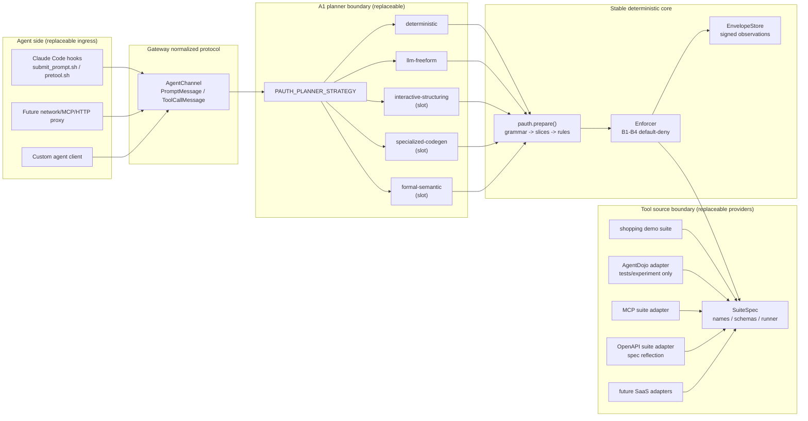
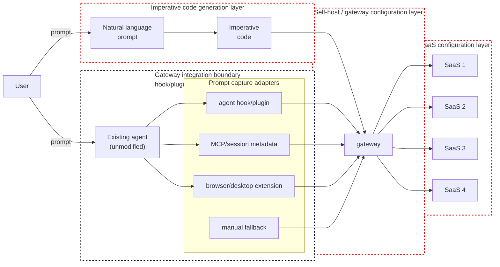

# architecture

PAuth-based task-scoped authorization gateway for unmodified agents
(Claude Code is the first target). This document captures the
system-level design that the implementation in `pauth/`, `gateway/`,
and `tests/` realises. Decision history lives in `grill.md`.
Current design status, open implementation ideas, rejected claims, and
development bottlenecks are separated in `gateway/DESIGN_STATUS.md`.

## 1. System overview

```
       ┌──────────┐
       │   USER   │
       └────┬─────┘
            │ types prompt
            ▼
   ┌─────────────────────────────────────────────────────────────────┐
   │                       Claude Code (UNMODIFIED)                  │
   │                                                                 │
   │   ┌──────────────────┐                  ┌────────────────────┐  │
   │   │ UserPromptSubmit │ ─── hook ───────►│ submit_prompt.sh   │  │
   │   │  (harness event) │                  └──────────┬─────────┘  │
   │   └──────────────────┘                             │            │
   │            │                                       │ HTTP POST  │
   │            ▼ LLM reasoning                         ▼            │
   │   ┌──────────────────┐                  ┌────────────────────┐  │
   │   │  tool decision   │ ─── hook ───────►│ pretool.sh         │  │
   │   │  (PreToolUse)    │                  └──────────┬─────────┘  │
   │   └──────────────────┘                             │            │
   │                                                    │ HTTP POST  │
   └────────────────────────────────────────────────────┼────────────┘
                                                        ▼
   ┌─────────────────────────────────────────────────────────────────┐
   │              gateway/serving/http_server.py  (long-running daemon)      │
   │                                                                 │
   │   POST /sessions/<id>/messages   -- prompt OR tool_call         │
   │                                                                 │
   │            ┌─────────────────────────────────────────────┐      │
   │            │            gateway.AgentChannel             │      │
   │            │  - one channel per Claude Code session_id   │      │
   │            │  - enforces "prompt first, exactly once"    │      │
   │            └────────────────────┬────────────────────────┘      │
   │                                 │                               │
   │                                 ▼                               │
   │            ┌─────────────────────────────────────────────┐      │
   │            │           gateway.Gateway                   │      │
   │            │  submit_user_prompt(prompt)     plan ONCE   │      │
   │            │  handle_tool_call(tool, args)   enforce ALL │      │
   │            └────────┬────────────────────────┬───────────┘      │
   │                     │ A1 → A2 → A3           │ B1 – B4          │
   │                     ▼                        ▼                  │
   │            ┌────────────────┐       ┌───────────────────┐       │
   │            │  pauth library │       │ suite runner      │       │
   │            │  (algorithm)   │       │ (real tool exec)  │       │
   │            └────────────────┘       └─────────┬─────────┘       │
   │                                               │                 │
   └───────────────────────────────────────────────┼─────────────────┘
                                                   │ real call
                                                   ▼
                                  ┌─────────────────────────────────┐
                                  │ SaaS / external system          │
                                  │ (shopping demo today;           │
                                  │  banking / slack / gmail / etc. │
                                  │  via per-user registration      │
                                  │  later)                         │
                                  └─────────────────────────────────┘
```

## 1.1 Loose-coupling map

The gateway should stay stable while three volatile areas change:

1. how an agent's traffic enters the gateway;
2. how a user prompt becomes restricted imperative code;
3. which real app / mock suite / SaaS backend provides tools.

Those areas are intentionally separated by small contracts.



### Coupling boundaries

| Boundary | Contract | Replaceable parts | Stable owner |
|---|---|---|---|
| Agent ingress | `PromptMessage` and `ToolCallMessage` | Claude hooks, future MCP/HTTP proxy, custom clients | `gateway/ingress/agent_channel.py` |
| Planner | restricted imperative `def run(...): ...` | deterministic recognizer, LLM free-form, interactive structuring, specialized model, formal parser | `gateway/planning/planner.py` |
| Tool source | `SuiteSpec` (`tools`, `make_env`, `runner_factory`) | shopping demo, AgentDojo, MCP servers, OpenAPI specs, future SaaS adapters | `pauth/suites/base.py` |
| Authorization core | compiled rules + envelope-backed operand checks | should not vary per provider | `pauth/` |

**Terminology note — "ingress" here is the *adapter* level only.** In this map,
"Agent ingress" names *which adapter* attaches an agent (hooks / proxy / custom
client), all normalizing into `PromptMessage` / `ToolCallMessage`. It does **not**
describe the wire-level direction of capture vs enforcement. The round-trip leg
model (往路/復路 × ingress/egress — where the prompt is observed, where tool calls
are observed, and the single leg where enforcement can act) is defined in
`gateway/INGRESS_DESIGN.md` → "Directional model". Keep the two vocabularies
distinct: this doc's "ingress" = adapter; that doc's 復路egress = the enforcement
tap. They are not synonyms.

AgentDojo belongs behind the **Tool source** boundary. It is a provider used
for benchmarks and mock environments, not the architectural center. If real
apps replace AgentDojo, they should implement or adapt into `SuiteSpec`; the
PAuth core and planner contract should not know whether the backing tool came
from AgentDojo, MCP, OpenAPI, or a hand-written suite.

OpenAPI-backed providers add one more operational loop: `gateway/providers/openapi_suite.py`
reflects the spec at load time, while `gateway/providers/api_spec_monitor.py` detects
spec changes and emits a notification-ready diff. The gateway should not
silently absorb upstream API changes without surfacing the changed tool surface
to the user.

## 1.2 Reference mental model

This is the working mental model from the user's white-background sketch
(`cloud local.pdf`, shared 2026-06-09). Future design discussion should keep
these three red-dotted zones separate.



Interpretation:

| Red-dotted zone | Meaning | Current repo anchor |
|---|---|---|
| Imperative code generation layer | The unresolved A1 problem: natural language to restricted `run()` code. | `gateway/planning/planner.py`, `gateway/PLANNING_STRATEGIES.md`, `pauth/codegen.py`, `gateway/planning/agentic_a1.py` |
| Self-host / gateway configuration layer | How users run/configure the gateway, choose planner strategy, manage sessions, reload changed specs, and receive audit/notification output. | `gateway/serving/http_server.py`, `gateway/serving/config.py`, `gateway/SELF_HOSTING.md`, `gateway/providers/api_spec_monitor.py` |
| SaaS configuration layer | How real apps/SaaS APIs are registered, reflected, monitored, and adapted into `SuiteSpec`. | `pauth/suites/base.py`, `gateway/providers/mcp_suite.py`, `gateway/providers/openapi_suite.py`, `gateway/providers/registry.py` |

The black dotted zone around the existing agent represents the gateway
integration boundary: a lifecycle hook/plugin forwards the clean prompt and
attempted tool calls, while network/tool routing prevents bypass. The existing
agent itself is deliberately outside the red design zones. The product goal is
to keep the agent runtime and day-to-day user workflow unmodified after setup,
while moving variability into gateway ingress, planner strategy, and
tool-source adapters. ("ingress" here = the adapter level; for the wire-level
往路/復路 × ingress/egress leg model see `gateway/INGRESS_DESIGN.md` →
"Directional model".)

Prompt capture is adapter-based. Different agents will expose different
signals, but every capture path must normalize into `PromptMessage` before it
reaches `AgentChannel`. The design target is not one universal prompt hook; it
is one universal prompt event contract.

## 2. Component responsibilities

| Component | Responsibility |
|---|---|
| `pauth/` | Pure PAuth algorithm. `codegen` (A1 LLM prompt), `grammar` (Appendix A parser), `slicing` (A2), `rules` (A3, Algorithm 1), `enforcer` (B1–B4), `envelope` (signed observations), `evaluator` (deterministic symbolic eval), `suites/base` (SuiteSpec interface). No knowledge of agents, hooks or HTTP. |
| `pauth/suites/shopping.py` | Self-contained demo suite: tools, environment, runner, and the worked-example reference codes / task definitions. Used by both paper reproduction (`tests/`) and gateway demos. |
| `gateway/planning/core.py` | NL → run() recognizer (deterministic, regex-driven). Used only for the strict path; the agentic/freeform path skips it. |
| `gateway/planning/planner.py` | Pluggable A1 boundary. Planner strategies emit restricted imperative code; `Gateway` compiles and enforces it through the stable PAuth pipeline. |
| `gateway/PLANNING_STRATEGIES.md` | A1 strategy catalogue: interactive structuring, specialized imperative-code model, and formal NL analysis. |
| `gateway/planning/agentic_a1.py` | LLM A1 with grammar-feedback loop (Q12). Wraps `pauth.codegen.SYSTEM_PROMPT`, catches `RestrictedGrammarError`, feeds the violated rule back to the LLM, retries up to N times. |
| `gateway/runtime/gateway.py` | `Gateway` class. Holds one task lifecycle. Two entry points: `submit_user_prompt(prompt)` (plan once) and `handle_tool_call(tool, args)` (enforce per call). |
| `gateway/ingress/agent_channel.py` | Agent-facing API. Two message kinds: `prompt` and `tool_call`. Enforces "prompt first, exactly once" structurally. JSON-serialisable wire shape. |
| `gateway/serving/http_server.py` | Minimal stdlib HTTP wrapper. `POST /sessions/<id>/messages`. Sessions keyed by client-supplied id (Claude Code's session_id). |
| `gateway/hooks/` | `submit_prompt.sh` (UserPromptSubmit) and `pretool.sh` (PreToolUse). Each is a thin curl-to-HTTP shim with strict / log modes. |
| `tests/` | Paper reproduction (`tests/test_worked_examples.py`, `tests/test_unexpected_attacks.py`, `tests/experiment/`) and L1/L2/L3 fixtures (`tests/fixtures/`). |

## 3. Data flow (one task lifecycle)

```
                    User prompt
                         │
        (1) UserPromptSubmit hook fires before the LLM sees the prompt
                         │
                         ▼
                 HTTP /sessions/<id>/messages
                 { "kind": "prompt", "prompt": "..." }
                         │
            ┌────────────┴───────────┐
            │ AgentChannel.receive   │
            │  - first prompt? OK    │
            │  - second prompt? ERR  │
            └────────────┬───────────┘
                         │
                         ▼
         Gateway.submit_user_prompt(prompt)
                         │
            ┌────────────┴────────────┐
            │ gateway.planner         │
            │  - deterministic        │   strict path
            │    recognizer           │
            │  - agentic LLM + repair │   freeform path
            │  - future planner       │   self-hosted app
            └────────────┬────────────┘
                         │
                         ▼
              pauth.prepare(code)
              ├─ grammar.parse_and_validate
              ├─ slicing.derive_slices     (A2)
              └─ rules.compile_rules       (A3)
                         │
                         ▼
                Session = { rules, env, store, runner }
                         │
                         │
   ─── now Claude Code's LLM starts; on every tool call: ───
                         │
                         ▼
                 PreToolUse hook fires
                         │
                         ▼
                 HTTP /sessions/<id>/messages
                 { "kind": "tool_call",
                   "tool": "...",
                   "kwargs": { ... } }
                         │
                         ▼
         AgentChannel resolves kwargs → schema-ordered args
                         │
                         ▼
         Gateway.handle_tool_call(tool, args)
                         │
            ┌────────────┴────────────┐
            │ Enforcer.check          │ B1, B2, B3 (paper)
            │  - rule exists?         │
            │  - guards satisfied?    │
            │  - operands match       │
            │    envelopes?           │
            └────────────┬────────────┘
                         │ permitted
                         ▼
               suite.runner(tool, kwargs)   real SaaS call
                         │
                         ▼
               wrap result + record envelope (B4)
                         │
                         ▼
               return result to agent
```

## 4. Hard invariants

These are enforced by code, not by convention.

1. **Plan once**. `Gateway.submit_user_prompt` is callable only once per
   session. `AgentChannel` rejects a second `PromptMessage`. The
   gateway never re-plans based on agent input.

2. **Tool calls require a prior prompt**. `AgentChannel._handle_tool_call`
   returns `ErrorResponse` if no prompt has been submitted.

3. **Gateway is the observation authority**. Every permitted tool call's
   result is executed by `suite.runner` (the gateway, not the agent)
   and recorded as an HMAC-signed envelope in the gateway-owned
   `EnvelopeStore`. Operand verification reads from this store, so an
   agent reporting fabricated intermediate values cannot influence
   subsequent operand checks.

4. **Default-deny**. `Enforcer.check` denies any call without an
   exact-matching rule (paper sec. 5.2). The rejected reason is
   surfaced verbatim to the caller for auditability.

5. **Single signing root**. The gateway owns the keyring. Envelopes are
   signed by the gateway, not by individual SaaS servers. The transcript
   labels this "personal client-side task-scoped firewall" -- it
   trades the paper's per-server autonomy for a single deployable.

## 5. Threat model

What the gateway defends against:

| Threat | Defended by |
|---|---|
| Agent issues a tool call not in the user-derived plan | Default-deny on missing rule (B1) |
| Agent inflates / substitutes a constant operand (recipient IBAN, amount, subject, date) | Operand match against compiled rules (B2/B3) |
| Agent fabricates a derived value (e.g. `cart.total` it never observed) | Symbolic evaluation against the envelope store; agent-reported values are ignored (B3) |
| Agent skips an observation tool and tries to use its symbolic result | Envelope missing → operand unresolved → denial |
| Agent calls a sensitive tool out of order | Guard evaluation requires upstream envelopes; missing → deny |
| Agent re-plans mid-session (e.g. on injection) | `AgentChannel` rejects second `PromptMessage` |
| Tool-result injection (paper sec. 3, AgentDojo's threat model) | Plan was generated from the clean user prompt before any tool output existed; injected actions are off-plan |

What the gateway does **not** defend against (explicitly out of scope):

| Threat | Why |
|---|---|
| Injection embedded in the user's prompt itself | UI / input window is trusted (user's responsibility). See Q11. |
| Agent silently modifies the prompt during the forwarding step | New trust assumption introduced by hook routing (Q13). Mitigation: `UserPromptSubmit` runs before the LLM sees the prompt, so the LLM cannot modify it. |
| Agent bypasses the hook (e.g. user disables it) | User is trusted (Q0). |
| Side channels (file system, child processes, env vars) | The gateway sees only tool calls. A real Claude Code firewall additionally needs Bash command policy and / or sandbox; see Q7 / Q10. |
| Prompt-correctness (does the plan actually capture intent?) | PAuth is an authorization layer, not a correctness oracle. The user may approve a plan that does the wrong thing -- enforcement only guarantees the agent stays within that plan. |

## 6. Key design decisions and where to find them

| Decision | Location |
|---|---|
| Plan once, enforce per call | gateway/runtime/gateway.py docstring; Q12 derivation |
| Recognizer-canonical path vs LLM A1 | gateway/planning/planner.py, gateway/planning/core.py, gateway/planning/agentic_a1.py; Q9, Q12 |
| Grammar feedback loop with explicit "you MUST obey rule X" | gateway/planning/agentic_a1.py; Q12 answer |
| Agent-facing channel and trust shift | gateway/ingress/agent_channel.py; Q13 |
| Self-hosted, user-registered SaaS | gateway/SELF_HOSTING.md; not yet implemented |
| Test data layered into L1 / L2 / L3 | tests/fixtures/; user discussion 2026-06-04 |
| AI-generated fixtures separated for review | tests/fixtures/ai_generated/ |

## 7. Operational notes

* Start the gateway daemon (`gateway/serving/http_server.py`) before opening
  Claude Code. The daemon holds session state in memory; restarting
  drops every active session.
* The hook scripts log to stderr; Claude Code surfaces stderr in its
  transcript.
* `GATEWAY_MODE_PROMPT=strict` blocks Claude Code on a rejected prompt.
  `GATEWAY_MODE_TOOL=log` is the current default for tool calls -- flip
  to `strict` once the enforced tool set is finalised.
* For the freeform LLM A1 path the user prompt must include enough
  literal constants (IBAN, subject, date, etc.) for the recognizer or
  the LLM to produce a usable run(). Underspecified prompts are
  rejected by design.

## 8. Multi-suite / pluggable tool sources

The gateway operates over a single ``SuiteSpec``, but
``gateway/providers/registry.py`` composes a *virtual* merged ``SuiteSpec`` from
any number of source suites. Tool names must be globally unique; the
registry validates this at registration time.

Pluggable backends today:

| Backend | File | Use |
|---|---|---|
| Self-contained shopping suite | `pauth/suites/shopping.py` | Demos, offline tests |
| AgentDojo suites | `tests/experiment/agentdojo_adapter.py` | Paper reproduction, banking/slack/travel/workspace |
| MCP server (HTTP) | `gateway/providers/mcp_suite.py` ``build_mcp_suite`` | Localhost MCP shims, real MCP servers that expose HTTP |
| MCP server (stdio) | `gateway/providers/mcp_suite.py` ``build_mcp_suite_stdio`` | Reference MCP servers (``@modelcontextprotocol/*``) and similar subprocess shapes |

Additional shaping layers:

* `gateway/runtime/policy.py` -- ``PolicyAwareEnforcer`` lets a deployer mark
  ``(tool, parameter)`` pairs as *free* operands so the enforcer skips
  the operand check there. Use for search queries, free-form message
  bodies, and similar operands that have no transactional meaning.
* `gateway/providers/suite_filter.py` -- bag-of-words ``SuiteFilter`` that narrows
  the merged universe to a subset that scores against the prompt. Keeps
  the A1 prompt small when many MCPs are registered. Pluggable scorer.
* `gateway/serving/config.py` -- JSON config consumed by the HTTP server's
  ``--config`` flag. Declares source suites, operand policy, suite
  filter parameters. Adapter table makes adding new backends a single
  function.

## 9. Deployment topology

Two deployment shapes are documented here. The self-hosted shape is the
near-term target; the managed-cloud shape is the aspirational version
we keep in mind so the abstractions don't paint us into a corner.

### 9.1 Self-hosted on Sakura, managed by Monocle (near-term)

```
                         ┌──────────────────────┐
                         │  USER (laptop / SSH) │
                         └──────────┬───────────┘
                                    │  ssh / web shell
                                    ▼
   ┌─────────────────────────────────────────────────────────────────┐
   │ Sakura Internet VM   (provisioned and managed by Monocle)       │
   │                                                                 │
   │  ┌─────────────────────────────────────────────────────────┐    │
   │  │  systemd unit: claude-code                              │    │
   │  │   └─ hooks: submit_prompt.sh / pretool.sh               │    │
   │  └────────────┬────────────────────────────────────────────┘    │
   │               │ localhost HTTP (127.0.0.1:8081)                 │
   │               ▼                                                 │
   │  ┌─────────────────────────────────────────────────────────┐    │
   │  │  systemd unit: gateway-http                             │    │
   │  │   - gateway/serving/http_server.py --config /etc/gateway.json   │    │
   │  │   - in-memory sessions, restart loses state             │    │
   │  └────────────┬────────────────────────────────────────────┘    │
   │               │                                                 │
   │     ┌─────────┴───────────────────────┐                         │
   │     │ stdio subprocess MCPs           │ HTTP MCPs              │
   │     ▼                                 ▼                         │
   │  ┌────────────────────┐   ┌────────────────────────────────┐    │
   │  │  @mcp/filesystem,  │   │  internal MCP HTTP shims,      │    │
   │  │  @mcp/git, etc.    │   │  bound to 127.0.0.1            │    │
   │  └────────────────────┘   └─────────────┬──────────────────┘    │
   │                                         │ outbound HTTPS         │
   └─────────────────────────────────────────┼────────────────────────┘
                                             │
                                             ▼  (Sakura egress, private route preferred)
                                ┌────────────────────────┐
                                │  public SaaS APIs       │
                                │  (Gmail, Linear, ...)   │
                                └────────────────────────┘
```

Operational choices:

* **One VM, one gateway, one user.** Multi-tenancy is out of scope at
  this stage. Session isolation is by Claude Code's ``session_id``.
* **State.** Sessions live in process memory. A ``systemctl restart``
  drops them. Acceptable while the user can simply re-send the prompt;
  revisit when long-running tasks become real.
* **Secrets.** SaaS credentials are held by the MCP processes
  themselves (their environment / config files), not by the gateway.
  The gateway never sees an API key -- it only authorises tool calls
  whose underlying transport already carries the credential.
* **Network.** ``gateway-http`` binds ``127.0.0.1`` so the HTTP API is
  not reachable off-box. The hooks reach it because they are local.
  No TLS on the local hop. Outbound to public SaaS uses Sakura's
  standard egress with whatever private routes Monocle exposes.
* **Logging / observability.** Gateway and hook scripts write to stderr;
  systemd's journal captures them; Monocle aggregates the journal.
* **Backup / restore.** Sessions are ephemeral. Config and suite
  registrations are flat files; Monocle's VM image handling covers them.
* **Update.** Application is Python source on the VM. Rolling an update
  is ``git pull`` + ``systemctl restart gateway-http`` and (if hook
  scripts changed) reloading Claude Code's settings.

Trade-offs vs the managed-cloud shape:

* (+) Cheap, fully under our control, low-latency hook calls.
* (+) No vendor lock-in; entire stack is files on a Linux VM.
* (-) Single point of failure; one VM down = no Claude Code.
* (-) Manual scaling. Fine for one user, untenable for many.
* (-) Restart loses sessions.

### 9.2 Managed cloud (AWS or Azure, aspirational)

The same code base; a different set of operational properties. We sketch
both AWS and Azure so the abstractions in `gateway/` stay portable.

```
                                  ┌──────────────────────┐
                                  │ USER (browser/IDE)   │
                                  └──────────┬───────────┘
                                             │ HTTPS / SSO
                                             ▼
                              ┌───────────────────────────────┐
                              │  Edge / WAF                   │
                              │  (CloudFront + WAF /          │
                              │   Front Door + WAF)           │
                              └──────────────┬────────────────┘
                                             │
   ┌─────────────────────────────────────────┼──────────────────────────┐
   │ private VPC / VNet                                                 │
   │                                                                    │
   │   ┌────────────────────────────────────────────────────────────┐   │
   │   │  Claude Code container (ECS Fargate / Container Apps)      │   │
   │   │  - hooks call the gateway over the private VPC             │   │
   │   │  - one task per user session (autoscaled)                  │   │
   │   └────────────────────────┬───────────────────────────────────┘   │
   │                            │ private DNS                            │
   │                            ▼                                        │
   │   ┌────────────────────────────────────────────────────────────┐   │
   │   │  Gateway service                                           │   │
   │   │  - Fargate / Container Apps autoscaled stateless workers   │   │
   │   │  - reads session state from managed KV                     │   │
   │   │  - reads config + secrets from Secrets Manager / Key Vault │   │
   │   └─────────┬────────────────────┬─────────────────────────────┘   │
   │             │                    │                                  │
   │             ▼                    ▼                                  │
   │   ┌────────────────────┐  ┌────────────────────────┐                │
   │   │ Session KV         │  │ Secrets / Config        │               │
   │   │ DynamoDB / Cosmos  │  │ Secrets Manager / KV    │               │
   │   └────────────────────┘  └────────────────────────┘                │
   │                                                                    │
   │   ┌─────────────────────────────────────────────────────────────┐  │
   │   │ MCP shims                                                   │  │
   │   │ - per-suite Lambdas / Functions (or sidecar containers)     │  │
   │   │ - hold per-user OAuth tokens issued via the SaaS provider   │  │
   │   └──────────────────────────┬──────────────────────────────────┘  │
   │                              │ VPC NAT / private endpoint           │
   └──────────────────────────────┼──────────────────────────────────────┘
                                  ▼
                       ┌────────────────────────┐
                       │ public SaaS APIs        │
                       └────────────────────────┘
```

Operational choices:

* **Containers, not Lambda/Functions for the gateway hot path.** Hooks
  block Claude Code; cold-start latency on serverless makes this
  user-visible. Keep the gateway as a long-running container service.
  MCP shims that wrap a single SaaS *can* be serverless because they
  are warmed by the gateway.
* **Stateless gateway, managed session store.** Move
  ``AgentChannel`` session state out of process memory and into
  DynamoDB or Cosmos DB. Keys are Claude Code's ``session_id``;
  envelopes / rules / plan blob serialise as JSON. Lose the "in-memory
  speed" property; gain horizontal scale and crash resilience.
* **Identity and isolation.** Per-user IAM role (AWS) or Managed
  Identity (Azure) on the Claude Code container. The gateway can
  authorise SaaS calls only for resources that role/identity is
  permitted to touch. Cuts the radius if a user's tokens leak.
* **Secrets.** Per-user OAuth tokens live in Secrets Manager (AWS) /
  Key Vault (Azure), scoped by the user's identity. The MCP shims pull
  the token at call time; the gateway never sees it.
* **Network.** Private VPC / VNet. Public access only through the edge
  WAF. Outbound to SaaS uses VPC NAT or a Private Endpoint when the
  SaaS supports it. Logging includes the egress headers so traffic
  out-of-VPC is auditable.
* **Observability.** CloudWatch / Application Insights. Each tool call
  generates a structured event; permit/deny + reason are first-class
  fields so a SIEM can spot anomalies.
* **Cost levers.** The gateway autoscales on RPS; MCP shims autoscale
  on per-suite QPS; session KV is on-demand pricing. Idle cost is
  bounded by the always-on gateway baseline.

Why not Vercel for the production hot path:

* Vercel's strength is serverless / edge functions for web
  frontends. The gateway's hooks are synchronous network calls from a
  long-running agent; serverless cold starts make the Claude Code
  experience flaky. Session state is global to a conversation; Vercel
  expects per-request statelessness.
* Vercel *is* a fine home for an admin UI or a status dashboard layered
  on top of the gateway. Hot path stays on container-based compute.

### 9.3 Mapping the codebase to the topology

| Abstraction | Self-hosted role | Cloud role |
|---|---|---|
| `gateway/serving/http_server.py` | systemd unit on the VM | container behind a private ALB / Application Gateway |
| `gateway/ingress/agent_channel.py` | unchanged | unchanged; session state externalised at the `_Session` boundary |
| `gateway/providers/registry.py` + `gateway/serving/config.py` | `gateway.json` on disk | config blob in Secrets Manager / Key Vault |
| `gateway/providers/mcp_suite.py` HTTP | localhost MCPs | private-DNS-addressed MCP services |
| `gateway/providers/mcp_suite.py` stdio | subprocess MCPs on the VM | sidecar containers or function-backed shims |
| `gateway/runtime/policy.py` | per-deployment JSON | per-tenant JSON in the config store |
| `gateway/providers/suite_filter.py` | unchanged | unchanged; consider an embedding-based scorer once the suite count grows |

The key invariant: **all abstractions live above the deployment
boundary**. The gateway's algorithmic core (`pauth/`) and the policy
layer (`gateway/runtime/policy.py`, `gateway/providers/registry.py`,
`gateway/providers/suite_filter.py`) are identical between topologies. Only the
operational substrate (state store, secret store, network) changes.

## 10. What is not built yet

* Real per-user SaaS registration UX (CLI / web UI). The config
  schema and the MCP backend (HTTP + stdio) are in place; what's
  missing is the operator-facing flow for registering a user's MCPs
  and OAuth tokens, especially in the cloud topology.
* MCP server *wrapper* around `AgentChannel`. The current direction is
  Claude Code hooks → HTTP. A native MCP-server expression of the
  gateway is the right next step when Claude Code's native tool
  routing (rather than hooks) becomes the integration point.
* L3 reference fixtures for AgentDojo suites. Type and one shopping
  family are in place (`tests/fixtures/l3_references.py` and
  `tests/fixtures/ai_generated/l3_references.py`); banking / slack /
  travel / workspace are still consumed via the existing AgentDojo
  adapter (`tests/experiment/agentdojo_adapter.py`).
* Embedding-based suite filter. The keyword filter in
  `gateway/providers/suite_filter.py` is the cheap default and good enough for a
  handful of MCPs; once registrations cross ~20 suites a small
  embedding model (or a cached LLM filter) will earn its keep.
* Externalised session store for the cloud topology. The
  in-memory `AgentChannel` sessions are the right default for the
  self-hosted VM; the cloud topology in §9.2 expects a managed KV
  (DynamoDB / Cosmos) that we have not implemented yet.
* Cross-file atomic checkpoint / agent-side rollback (Q2 γ'). Not
  needed yet because no agent state is mutated by the gateway itself.
