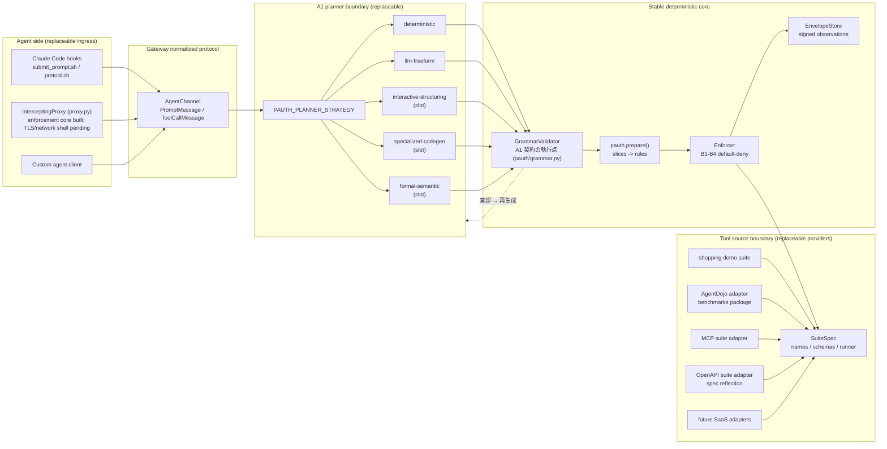
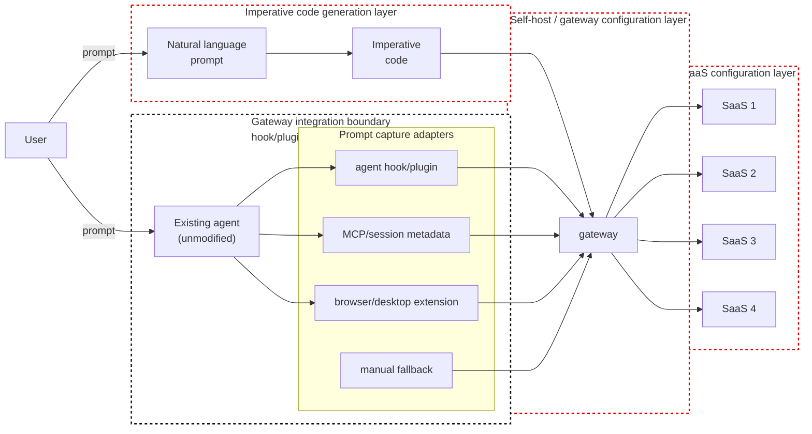

# アーキテクチャ

PAuth に基づく、改変不要でタスク単位の認可を行うエージェント向けゲートウェイ
(最初の対象は Claude Code)。本書は、`pauth/`・`gateway/`・`tests/` の実装が
体現しているシステム水準の設計を記述する。現在の設計状況、未実装の構想、
棄却した主張、開発上のボトルネックは `DESIGN_STATUS.md` に切り出してある。

## 1. システム概要

```
       ┌──────────┐
       │   USER   │
       └────┬─────┘
            │ types prompt
            ▼
   ┌─────────────────────────────────────────────────────────────────┐
   │                       Claude Code (UNMODIFIED)                  │
   │                                                                 │
   │   ┌──────────────────┐                  ┌────────────────────┐  │
   │   │ UserPromptSubmit │ ─── hook ───────►│ submit_prompt.sh   │  │
   │   │  (harness event) │                  └──────────┬─────────┘  │
   │   └──────────────────┘                             │            │
   │            │                                       │ HTTP POST  │
   │            ▼ LLM reasoning                         ▼            │
   │   ┌──────────────────┐                  ┌────────────────────┐  │
   │   │  tool decision   │ ─── hook ───────►│ pretool.sh         │  │
   │   │  (PreToolUse)    │                  └──────────┬─────────┘  │
   │   └──────────────────┘                             │            │
   │                                                    │ HTTP POST  │
   └────────────────────────────────────────────────────┼────────────┘
                                                        ▼
   ┌─────────────────────────────────────────────────────────────────┐
   │              gateway/serving/http_server.py  (long-running daemon)      │
   │                                                                 │
   │   POST /sessions/<id>/messages   -- prompt OR tool_call         │
   │                                                                 │
   │            ┌─────────────────────────────────────────────┐      │
   │            │            gateway.AgentChannel             │      │
   │            │  - one channel per Claude Code session_id   │      │
   │            │  - enforces "prompt first, exactly once"    │      │
   │            └────────────────────┬────────────────────────┘      │
   │                                 │                               │
   │                                 ▼                               │
   │            ┌─────────────────────────────────────────────┐      │
   │            │           gateway.Gateway                   │      │
   │            │  submit_user_prompt(prompt)     plan ONCE   │      │
   │            │  handle_tool_call(tool, args)   enforce ALL │      │
   │            └────────┬────────────────────────┬───────────┘      │
   │                     │ A1 → A2 → A3           │ B1 – B4          │
   │                     ▼                        ▼                  │
   │            ┌────────────────┐       ┌───────────────────┐       │
   │            │  pauth library │       │ suite runner      │       │
   │            │  (algorithm)   │       │ (real tool exec)  │       │
   │            └────────────────┘       └─────────┬─────────┘       │
   │                                               │                 │
   └───────────────────────────────────────────────┼─────────────────┘
                                                   │ real call
                                                   ▼
                                  ┌─────────────────────────────────┐
                                  │ SaaS / external system          │
                                  │ (shopping demo today;           │
                                  │  banking / slack / gmail / etc. │
                                  │  via per-user registration      │
                                  │  later)                         │
                                  └─────────────────────────────────┘
```

> **注意 — 上図は現行で稼働している hooks 傍受経路を描いている。** 戦略上の
> 橋頭堡は Mode 1(SDK / 直接統合)であり、hooks は差し替え可能な ingress
> アダプタの一つにすぎない(決定の経緯は `INGRESS_DESIGN.md`)。SDK アダプタが
> コードとして存在した時点で、本図を実際の ingress 構成に合わせて更新する。

## 1.1 疎結合の見取り図

ゲートウェイは、変化の激しい次の三つの領域が自由に動けるようにしつつ、
自身は安定を保つべきである。

1. エージェントの通信がどのようにゲートウェイへ入ってくるか。
2. ユーザーのプロンプトがどのように制限された命令型コードになるか。
3. どの実アプリ/モックスイート/SaaS バックエンドがツールを提供するか。

これらの領域は、意図的に小さな契約によって分離されている。



**GrammarValidator(制限文法検証器)について。** 制限文法(論文付録 A)は
Planner 境界の*契約そのもの*であり、その執行点をノードとして図示している。
実装は `pauth/grammar.py` の一箇所(構文検査 `parse_and_validate` → 死コード
除去 `strip_dead_code` → 意味検査 `validate_semantics`)だが、呼び出し側は
二つある: Planner 側のリトライループ(`gateway/planning/agentic_planner.py`
が棄却理由を LLM に返して再生成する)と、`pauth.prepare()` 内の再検証で
ある。所有者は安定核(`pauth/`)なので、ノードも StableCore 側に置く。
文法棄却は Enforcer の拒否とは別の失敗クラス(Planner 失敗)として評価
ファネルに計上される。

### 結合境界

| 境界 | 契約 | 差し替え可能な部分 | 安定した所有者 |
|---|---|---|---|
| エージェント ingress | `PromptMessage` と `ToolCallMessage` | Claude hooks、InterceptingProxy(`gateway/serving/proxy.py`、執行の中核は実装済み、TLS/ネットワーク外殻は未着手)、独自クライアント | `gateway/ingress/agent_channel.py` |
| Planner | 制限された命令型の `def run(...): ...`(執行点は GrammarValidator = `pauth/grammar.py`) | 決定的認識器、LLM 自由生成、対話的構造化、特化モデル、形式的構文解析器 | `gateway/planning/planner.py` |
| ツール供給源 | `SuiteSpec`(`tools`、`make_env`、`runner_factory`) | 買い物デモ、AgentDojo、MCP サーバー、OpenAPI 仕様、将来の SaaS アダプタ | `pauth/suites/base.py` |
| 認可の中核 | コンパイル済みルール + envelope に裏付けられたオペランド検査 | プロバイダごとに変わるべきではない | `pauth/` |

**用語に関する注意 — 本書の "ingress" は*アダプタ*の水準だけを指す。**
この見取り図で「エージェント ingress」が指すのは、エージェントを接続する
*どのアダプタか*(hooks/プロキシ/独自クライアント)であり、いずれも
`PromptMessage` / `ToolCallMessage` へ正規化される。往復のどの区間(leg)で
観測・執行が働くかという通信路水準の語彙(request/response × ingress/egress)
は `INGRESS_DESIGN.md` の「方向モデル」が定義する。二水準の定義は
`GLOSSARY.md` の「ingress の二水準」を正とする。

### 境界設計から導かれる帰結

- エージェントごとに専用の導入アダプタが必要になりうる。すべてのアダプタが同一の
  契約(`PromptMessage` / `ToolCallMessage`)へ正規化する限り、それは許容できる。
- 製品の中核は Claude Code hook ではない。Claude Code は一つのアダプタにすぎない。
- バイパスを防ぐためにネットワーク経路の制御は必要だが、プロンプトとツール呼び出し
  の捕捉を併せて行わない限り、PAuth の執行には十分でない。
- ホスティングは運用上の判断である。Planner の論理、執行の論理、`SuiteSpec` に
  漏れ込んではならない(§9 の配備形態はこの原則の上に載る)。
- ゲートウェイは自身の実効的な保護レベル(`DESIGN_STATUS.md` の L0–L3)を報告し
  なければならない。プロンプト捕捉や経路制御を欠くとき、そのセッションを完全な
  PAuth 保護と称してはならない。

AgentDojo は**ツール供給源**境界の内側に属する。ベンチマークとモック環境で
使われる一つのプロバイダであって、アーキテクチャの中心ではない。実アプリが
AgentDojo を置き換えるなら、それらは `SuiteSpec` を実装するか適合させるべき
であり、PAuth の中核と Planner の契約は、背後のツールが AgentDojo・MCP・
OpenAPI・手書きのスイートのどれに由来するかを知るべきではない。

OpenAPI に基づくプロバイダは運用の輪をもう一つ加える。
`gateway/providers/openapi_suite.py` が読み込み時に仕様を反映し、
`gateway/providers/api_spec_monitor.py` が仕様の変更を検知して通知に使える
差分を出力する。ゲートウェイは、変更されたツール面をユーザーに提示しない
まま、上流の API の変更を黙って取り込むべきではない。

## 1.2 参照用の思考モデル

これは、ユーザーの白背景の手描き図(`cloud local.pdf`、2026-06-09 共有)から
導いた作業用の思考モデルである。今後の設計議論では、この三つの赤点線の区画を
分けて考えること。



読み解き:

| 赤点線の区画 | 意味 | 現在のリポジトリにおける対応箇所 |
|---|---|---|
| 命令型コード生成層 | 未解決の A1 問題:自然言語から制限された `run()` コードへ。 | `gateway/planning/planner.py`、`PLANNING_STRATEGIES.md`、`pauth/codegen.py`、`gateway/planning/agentic_planner.py` |
| セルフホスト/ゲートウェイ設定層 | ユーザーがゲートウェイをどう起動・設定し、Planner 戦略を選び、セッションを管理し、変更された仕様を再読み込みし、監査・通知の出力を受け取るか。 | `gateway/serving/http_server.py`、`gateway/serving/config.py`、`SELF_HOSTING.md`、`gateway/providers/api_spec_monitor.py` |
| SaaS 設定層 | 実アプリ/SaaS API をどのように登録・反映・監視し、`SuiteSpec` へ適合させるか。 | `pauth/suites/base.py`、`gateway/providers/mcp_suite.py`、`gateway/providers/openapi_suite.py`、`gateway/providers/registry.py` |

既存エージェントを囲む黒点線の区画は、ゲートウェイ統合境界を表す。
ライフサイクルの hook/プラグインが、汚染されていないプロンプトと試行された
ツール呼び出しを転送し、ネットワーク/ツール経路の制御が迂回を防ぐ。既存
エージェント自体は、意図的に赤い設計区画の外に置かれている。製品としての
目標は、導入後もエージェントの実行環境とユーザーの日常の作業手順を無改変の
まま保ちつつ、変動をゲートウェイの ingress、Planner 戦略、ツール供給源
アダプタへ移すことである。(ここでの "ingress" = アダプタ水準。通信路上の
区間モデル(request/response × ingress/egress)は `INGRESS_DESIGN.md` の
「方向モデル」を参照。)

プロンプト捕捉はアダプタ方式である。エージェントごとに得られる信号は
異なるが、どの捕捉経路も `AgentChannel` に届く前に `PromptMessage` へ
正規化されなければならない。設計の狙いは、万能のプロンプト hook を一つ
作ることではなく、万能のプロンプトイベント契約を一つ定めることである。

## 2. 構成要素の責務

| 構成要素 | 責務 |
|---|---|
| `pauth/` | 純粋な PAuth アルゴリズム。`codegen`(A1 の LLM プロンプト)、`grammar`(付録 A のパーサ)、`slicing`(A2)、`rules`(A3、Algorithm 1)、`enforcer`(B1–B4)、`envelope`(署名付き観測)、`evaluator`(決定的な記号評価)、`suites/base`(SuiteSpec インタフェース)。エージェント・hook・HTTP のことは一切知らない。 |
| `pauth/suites/shopping.py` | 自己完結したデモスイート:ツール、環境、runner に加え、worked example の参照コードとタスク定義。論文再現(`tests/`)とゲートウェイのデモの両方で使う。 |
| `gateway/planning/core.py` | 自然言語 → run() の認識器(決定的、正規表現駆動)。strict 経路でのみ使われ、agentic/自由生成経路では飛ばされる。 |
| `gateway/planning/planner.py` | 差し替え可能な A1 境界。Planner 戦略が制限された命令型コードを出力し、`Gateway` がそれを安定した PAuth パイプラインでコンパイルし執行する。 |
| `PLANNING_STRATEGIES.md` | A1 戦略の目録:対話的構造化、命令型コード特化モデル、形式的な自然言語解析。 |
| `gateway/planning/agentic_planner.py` | 文法フィードバックループ付きの LLM A1(Q12)。`pauth.codegen.SYSTEM_PROMPT` を包み、`RestrictedGrammarError` を捕捉し、違反した規則を LLM に返して最大 N 回まで再試行する。 |
| `gateway/runtime/gateway.py` | `Gateway` クラス。タスク一件のライフサイクルを保持する。入口は二つ:`submit_user_prompt(prompt)`(計画は一度だけ)と `handle_tool_call(tool, args)`(呼び出しごとに執行)。 |
| `gateway/ingress/agent_channel.py` | エージェント向け API。メッセージは `prompt` と `tool_call` の二種。「プロンプトが最初、かつ一度だけ」を構造的に強制する。JSON 直列化可能な通信形。 |
| `gateway/serving/http_server.py` | 標準ライブラリだけの最小 HTTP ラッパ。`POST /sessions/<id>/messages`。セッションはクライアントが与える id(Claude Code の session_id)で引く。 |
| `gateway/hooks/` | `submit_prompt.sh`(UserPromptSubmit)と `pretool.sh`(PreToolUse)。curl で HTTP へ橋渡しする薄い層で、それぞれ strict / log モードを持つ。 |
| `tests/` | 論文再現(`tests/test_worked_examples.py`、`tests/test_unexpected_attacks.py`、`tests/experiment/`)と L1/L2/L3 の fixture(`tests/fixtures/`)。 |

## 3. データフロー(タスク一件のライフサイクル)

```
                    User prompt
                         │
        (1) UserPromptSubmit hook fires before the LLM sees the prompt
                         │
                         ▼
                 HTTP /sessions/<id>/messages
                 { "kind": "prompt", "prompt": "..." }
                         │
            ┌────────────┴───────────┐
            │ AgentChannel.receive   │
            │  - first prompt? OK    │
            │  - second prompt? ERR  │
            └────────────┬───────────┘
                         │
                         ▼
         Gateway.submit_user_prompt(prompt)
                         │
            ┌────────────┴────────────┐
            │ gateway.planner         │
            │  - deterministic        │   strict path
            │    recognizer           │
            │  - agentic LLM + repair │   freeform path
            │  - future planner       │   self-hosted app
            └────────────┬────────────┘
                         │
                         ▼
              pauth.prepare(code)
              ├─ grammar.parse_and_validate
              ├─ slicing.derive_slices     (A2)
              └─ rules.compile_rules       (A3)
                         │
                         ▼
                Session = { rules, env, store, runner }
                         │
                         │
   ─── now Claude Code's LLM starts; on every tool call: ───
                         │
                         ▼
                 PreToolUse hook fires
                         │
                         ▼
                 HTTP /sessions/<id>/messages
                 { "kind": "tool_call",
                   "tool": "...",
                   "kwargs": { ... } }
                         │
                         ▼
         AgentChannel resolves kwargs → schema-ordered args
                         │
                         ▼
         Gateway.handle_tool_call(tool, args)
                         │
            ┌────────────┴────────────┐
            │ Enforcer.check          │ B1, B2, B3 (paper)
            │  - rule exists?         │
            │  - guards satisfied?    │
            │  - operands match       │
            │    envelopes?           │
            └────────────┬────────────┘
                         │ permitted
                         ▼
               suite.runner(tool, kwargs)   real SaaS call
                         │
                         ▼
               wrap result + record envelope (B4)
                         │
                         ▼
               return result to agent
```

## 4. 厳格な不変条件

これらは慣習ではなく、コードによって強制される。

1. **計画は一度だけ**。`Gateway.submit_user_prompt` はセッションごとに一度しか
   呼べない。`AgentChannel` は二通目の `PromptMessage` を拒絶する。ゲートウェイが
   エージェントの入力に基づいて計画を作り直すことはない。

2. **ツール呼び出しには先行するプロンプトが必要**。プロンプトが未提出であれば、
   `AgentChannel._handle_tool_call` は `ErrorResponse` を返す。

3. **観測の正本はゲートウェイである**。許可された各ツール呼び出しの結果は
   (エージェントではなく)ゲートウェイである `suite.runner` が実行し、
   ゲートウェイ所有の `EnvelopeStore` に HMAC 署名付き envelope として記録
   される。オペランド検証はこのストアから読むため、エージェントが中間値を
   偽って報告しても、後続のオペランド検査には影響できない。

4. **デフォルト拒否**。`Enforcer.check` は、完全一致するルールを持たない
   すべての呼び出しを拒絶する(論文 5.2 節)。拒絶理由は監査可能性のため、
   呼び出し元へそのまま提示される。

5. **署名の根は一つ**。鍵束はゲートウェイが所有する。envelope に署名するのは
   ゲートウェイであり、個々の SaaS サーバーではない。書き起こしではこれを
   「個人用のクライアント側タスク単位ファイアウォール」と呼んでいる —— 論文の
   サーバーごとの自律性を手放す代わりに、単一の配備可能な成果物を得ている。

## 5. 脅威モデル

ゲートウェイが防ぐのは、乗っ取られたエージェントが**固定済みの計画の外**で行動する
ことである。計画にないツール呼び出し、オペランドの水増し・すり替え・捏造、観測の
省略や順序違反、セッション途中の計画の作り直し、ツール結果を介した行動注入は、
いずれもデフォルト拒否(B1–B4)と署名付き envelope によって拒絶される。一方、
ユーザーのプロンプト自体に埋め込まれた injection、hook の無効化・迂回、サイド
チャネル、計画そのものの正しさは、明示的に対象外である。

詳細な脅威一覧・防御機構・実装状態は `THREAT_MODEL.md` を正とする(§2 に防御表、
§5 に対象外の一覧)。本書の役割は、§4 の不変条件がそれらの防御をコードでどう
強制しているかを示すことに限る。

## 6. 主要な設計判断と参照先

| 判断 | 所在 |
|---|---|
| 計画は一度、執行は呼び出しごと | gateway/runtime/gateway.py の docstring、Q12 の導出 |
| 認識器を正準とする経路と LLM A1 の対比 | gateway/planning/planner.py、gateway/planning/core.py、gateway/planning/agentic_planner.py、Q9・Q12 |
| 「規則 X には必ず従え」と明示する文法フィードバックループ | gateway/planning/agentic_planner.py、Q12 の回答 |
| エージェント向けチャネルと信頼の移動 | gateway/ingress/agent_channel.py、Q13 |
| セルフホストで、ユーザーが SaaS を登録する方式 | SELF_HOSTING.md、未実装 |
| テストデータの L1 / L2 / L3 への階層化 | tests/fixtures/、2026-06-04 のユーザーとの議論 |
| AI 生成 fixture をレビューのため分離 | tests/fixtures/ai_generated/ |

## 7. 運用上の注意

* Claude Code を開く前に、ゲートウェイのデーモン
  (`gateway/serving/http_server.py`)を起動すること。デーモンはセッション状態を
  メモリに保持するため、再起動するとアクティブなセッションはすべて失われる。
* hook スクリプトは stderr にログを書く。Claude Code は stderr を自身の
  書き起こしへ表示する。
* `GATEWAY_MODE_PROMPT=strict` は、拒絶されたプロンプトで Claude Code を
  停止させる。ツール呼び出しの現在の既定は `GATEWAY_MODE_TOOL=log` —— 執行
  対象のツール集合が固まったら `strict` へ切り替えること。
* 自由生成の LLM A1 経路では、認識器や LLM が使える run() を生成できるだけの
  文字通りの定数(IBAN、件名、日付など)がユーザープロンプトに含まれていな
  ければならない。指定の足りないプロンプトは、設計上の意図として拒絶される。

## 8. 複数スイート/差し替え可能なツール供給源

ゲートウェイは単一の ``SuiteSpec`` の上で動作するが、
``gateway/providers/registry.py`` が任意個の元スイートを併合した*仮想的な*
``SuiteSpec`` を合成する。ツール名は全体で一意でなければならず、レジストリが
登録時にこれを検証する。

現在差し替え可能なバックエンド:

| バックエンド | ファイル | 用途 |
|---|---|---|
| 自己完結の買い物スイート | `pauth/suites/shopping.py` | デモ、オフラインのテスト |
| AgentDojo のスイート群 | `benchmarks/agentdojo_adapter.py` | 論文再現、banking/slack/travel/workspace |
| MCP サーバー(HTTP) | `gateway/providers/mcp_suite.py` ``build_mcp_suite`` | localhost の MCP shim、HTTP を公開する実 MCP サーバー |
| MCP サーバー(stdio) | `gateway/providers/mcp_suite.py` ``build_mcp_suite_stdio`` | 参照実装の MCP サーバー(``@modelcontextprotocol/*``)など、サブプロセス型のもの |

追加の整形層:

* `gateway/runtime/policy.py` —— ``PolicyAwareEnforcer`` により、配備者が
  ``(tool, parameter)`` の組を*自由*オペランドとして印付けでき、Enforcer は
  そこでのオペランド検査を飛ばす。検索クエリや自由記述のメッセージ本文など、
  取引上の意味を持たないオペランドに使う。
* `gateway/providers/suite_filter.py` —— bag-of-words の ``SuiteFilter``。
  併合された全体集合を、プロンプトに対して採点した部分集合へ絞り込む。多数の
  MCP を登録しても A1 のプロンプトを小さく保てる。採点器は差し替え可能。
* `gateway/serving/config.py` —— HTTP サーバーの ``--config`` フラグが読む
  JSON 設定。元スイート、オペランドの方針、スイートフィルタの各種の値を
  宣言する。アダプタ表のおかげで、新しいバックエンドの追加は関数一つで済む。

## 9. 配備形態

ここでは二つの配備形態を述べる。セルフホスト形態が短期の目標であり、
マネージドクラウド形態は、抽象が袋小路に陥らないよう念頭に置いておく
将来構想である。

### 9.1 Sakura 上のセルフホスト、Monocle による管理(短期)

```
                         ┌──────────────────────┐
                         │  USER (laptop / SSH) │
                         └──────────┬───────────┘
                                    │  ssh / web shell
                                    ▼
   ┌─────────────────────────────────────────────────────────────────┐
   │ Sakura Internet VM   (provisioned and managed by Monocle)       │
   │                                                                 │
   │  ┌─────────────────────────────────────────────────────────┐    │
   │  │  systemd unit: claude-code                              │    │
   │  │   └─ hooks: submit_prompt.sh / pretool.sh               │    │
   │  └────────────┬────────────────────────────────────────────┘    │
   │               │ localhost HTTP (127.0.0.1:8081)                 │
   │               ▼                                                 │
   │  ┌─────────────────────────────────────────────────────────┐    │
   │  │  systemd unit: gateway-http                             │    │
   │  │   - gateway/serving/http_server.py --config /etc/gateway.json   │    │
   │  │   - in-memory sessions, restart loses state             │    │
   │  └────────────┬────────────────────────────────────────────┘    │
   │               │                                                 │
   │     ┌─────────┴───────────────────────┐                         │
   │     │ stdio subprocess MCPs           │ HTTP MCPs              │
   │     ▼                                 ▼                         │
   │  ┌────────────────────┐   ┌────────────────────────────────┐    │
   │  │  @mcp/filesystem,  │   │  internal MCP HTTP shims,      │    │
   │  │  @mcp/git, etc.    │   │  bound to 127.0.0.1            │    │
   │  └────────────────────┘   └─────────────┬──────────────────┘    │
   │                                         │ outbound HTTPS         │
   └─────────────────────────────────────────┼────────────────────────┘
                                             │
                                             ▼  (Sakura egress, private route preferred)
                                ┌────────────────────────┐
                                │  public SaaS APIs       │
                                │  (Gmail, Linear, ...)   │
                                └────────────────────────┘
```

運用上の選択:

* **1 VM、1 ゲートウェイ、1 ユーザー。** この段階ではマルチテナントは対象外。
  セッションの分離は Claude Code の ``session_id`` による。
* **状態。** セッションはプロセスのメモリ上にあり、``systemctl restart`` で
  失われる。ユーザーがプロンプトを出し直せば済むうちは許容する。長時間走る
  タスクが現実のものになったら見直す。
* **秘密情報(credential broker モデル、S4)。** ゲートウェイが SaaS の資格情報を
  **保持し、実行する**。L3(ゲートウェイ自身がツールを実行し、署名付き
  envelope を記録する形態)を成立させるには、実行主体であるゲートウェイが
  資格情報を持たなければならない。実行点と執行点を分離する旧モデル
  (「ゲートウェイは API キーを見ない」)は L3 と両立せず、破棄した。鍵の
  集約点になる危険は、このセルフホスト形態(ユーザー自身の VM 上で動く
  1 VM / 1 ユーザー)を前提とすることで受け入れる。broker 実装の要件:
  スイートごとに分離した保管、ローテーション、アクセス監査。(実装は最初の
  実 SaaS 統合と併せて行う。)
* **ネットワーク。** ``gateway-http`` は ``127.0.0.1`` に束縛されるため、HTTP
  API に外部から到達することはできない。hook はローカルなので到達できる。
  ローカル区間に TLS はない。公開 SaaS への外向き通信は、Sakura の標準の
  egress と、Monocle が提供する私設経路を併用する。
* **ログ/可観測性。** ゲートウェイと hook スクリプトは stderr に書き、
  systemd の journal がそれを捕捉し、Monocle が journal を集約する。
* **バックアップ/復旧。** セッションは揮発とする。設定とスイート登録は平文の
  ファイルであり、Monocle の VM イメージ管理が面倒を見る。
* **更新。** アプリケーションは VM 上の Python ソースである。更新の適用は
  ``git pull`` + ``systemctl restart gateway-http``、(hook スクリプトが変わった
  場合は)Claude Code の設定の再読み込み。

マネージドクラウド形態と比べたときの利点と欠点:

* (+) 安価で、全体を自分たちで掌握でき、hook 呼び出しの遅延が小さい。
* (+) 特定の業者への束縛がない。スタック全体が Linux VM 上のファイルにすぎない。
* (-) 単一障害点。VM が 1 台落ちれば Claude Code が使えなくなる。
* (-) 拡張は手作業。1 ユーザーには十分だが、多数には耐えない。
* (-) 再起動でセッションが失われる。

### 9.2 マネージドクラウド(AWS または Azure、将来構想)

同じコードベースを、異なる運用特性の組で動かす。`gateway/` 内の抽象が
可搬であり続けるよう、AWS と Azure の両方を素描しておく。

```
                                  ┌──────────────────────┐
                                  │ USER (browser/IDE)   │
                                  └──────────┬───────────┘
                                             │ HTTPS / SSO
                                             ▼
                              ┌───────────────────────────────┐
                              │  Edge / WAF                   │
                              │  (CloudFront + WAF /          │
                              │   Front Door + WAF)           │
                              └──────────────┬────────────────┘
                                             │
   ┌─────────────────────────────────────────┼──────────────────────────┐
   │ private VPC / VNet                                                 │
   │                                                                    │
   │   ┌────────────────────────────────────────────────────────────┐   │
   │   │  Claude Code container (ECS Fargate / Container Apps)      │   │
   │   │  - hooks call the gateway over the private VPC             │   │
   │   │  - one task per user session (autoscaled)                  │   │
   │   └────────────────────────┬───────────────────────────────────┘   │
   │                            │ private DNS                            │
   │                            ▼                                        │
   │   ┌────────────────────────────────────────────────────────────┐   │
   │   │  Gateway service                                           │   │
   │   │  - Fargate / Container Apps autoscaled stateless workers   │   │
   │   │  - reads session state from managed KV                     │   │
   │   │  - reads config + secrets from Secrets Manager / Key Vault │   │
   │   └─────────┬────────────────────┬─────────────────────────────┘   │
   │             │                    │                                  │
   │             ▼                    ▼                                  │
   │   ┌────────────────────┐  ┌────────────────────────┐                │
   │   │ Session KV         │  │ Secrets / Config        │               │
   │   │ DynamoDB / Cosmos  │  │ Secrets Manager / KV    │               │
   │   └────────────────────┘  └────────────────────────┘                │
   │                                                                    │
   │   ┌─────────────────────────────────────────────────────────────┐  │
   │   │ MCP shims                                                   │  │
   │   │ - per-suite Lambdas / Functions (or sidecar containers)     │  │
   │   │ - hold per-user OAuth tokens issued via the SaaS provider   │  │
   │   └──────────────────────────┬──────────────────────────────────┘  │
   │                              │ VPC NAT / private endpoint           │
   └──────────────────────────────┼──────────────────────────────────────┘
                                  ▼
                       ┌────────────────────────┐
                       │ public SaaS APIs        │
                       └────────────────────────┘
```

運用上の選択:

* **ゲートウェイの高頻度経路は Lambda/Functions ではなくコンテナ。** hook は
  Claude Code を停止させて待つため、サーバーレスのコールドスタート遅延は
  ユーザーの目に見えてしまう。ゲートウェイは常駐のコンテナサービスに保つ。
  単一の SaaS を包む MCP shim はサーバーレスでも*構わない*。ゲートウェイが
  温めた状態に保つからである。
* **ゲートウェイは無状態、セッションはマネージドストアへ。** ``AgentChannel``
  のセッション状態をプロセスメモリから DynamoDB または Cosmos DB へ移す。
  Claude Code の ``session_id`` を鍵とし、envelope・ルール・計画の一塊は JSON
  に直列化する。「メモリ内の速さ」という性質は失うが、水平方向の拡張と障害
  への耐性を得る。
* **アイデンティティと分離。** Claude Code コンテナにユーザーごとの IAM ロール
  (AWS)または Managed Identity(Azure)を与える。ゲートウェイは、その
  ロール/アイデンティティが触れることを許された資源に対してしか SaaS 呼び出し
  を認可できない。ユーザーのトークンが漏れた場合の被害範囲を狭める。
* **秘密情報(credential broker モデル、S4)。** ユーザーごとの OAuth トークンは、
  ユーザーのアイデンティティで範囲を限った Secrets Manager(AWS)/ Key Vault
  (Azure)に置き、**ゲートウェイ(broker)が呼び出し時に取り出してツールを
  実行する**。MCP shim を経由する場合でも、shim はゲートウェイの管理下にある
  構成要素であり、資格情報の取得経路と実行経路の双方をゲートウェイの監査境界の
  内側に保つ。
* **ネットワーク。** 私設の VPC / VNet。公開アクセスは縁の WAF 経由のみ。SaaS
  への外向きは VPC NAT を使い、SaaS が対応していれば Private Endpoint を使う。
  ログには egress ヘッダを含めるので、VPC から出る通信は監査できる。
* **可観測性。** CloudWatch / Application Insights。各ツール呼び出しは構造化
  イベントを生み、許可/拒否とその理由が第一級のフィールドになっているため、
  SIEM が異常を発見できる。
* **費用の調整点。** ゲートウェイは RPS で自動拡張し、MCP shim はスイート
  ごとの QPS で自動拡張し、セッション KV は従量課金とする。待機中の費用は
  常駐ゲートウェイの基礎分に抑えられる。

本番の高頻度経路に Vercel を使わない理由:

* Vercel の強みは、Web フロントエンド向けのサーバーレス/エッジ関数である。
  ゲートウェイの hook は常駐エージェントからの同期的なネットワーク呼び出しで
  あり、サーバーレスのコールドスタートは Claude Code の体験を不安定にする。
  セッション状態は会話全体にわたるが、Vercel はリクエスト単位の無状態を前提と
  する。
* Vercel は、ゲートウェイの上に載せる管理 UI や状態表示の置き場としては
  *良い*。高頻度経路はコンテナ型の計算基盤に置き続けること。

### 9.3 コードベースと配備形態の対応

| 抽象 | セルフホストでの役割 | クラウドでの役割 |
|---|---|---|
| `gateway/serving/http_server.py` | VM 上の systemd unit | 私設 ALB / Application Gateway の背後のコンテナ |
| `gateway/ingress/agent_channel.py` | 変更なし | 変更なし。セッション状態は `_Session` 境界で外部化する |
| `gateway/providers/registry.py` + `gateway/serving/config.py` | ディスク上の `gateway.json` | Secrets Manager / Key Vault 内の設定データ |
| `gateway/providers/mcp_suite.py` HTTP | localhost の MCP 群 | 私設 DNS で引く MCP サービス群 |
| `gateway/providers/mcp_suite.py` stdio | VM 上のサブプロセス MCP 群 | サイドカーコンテナまたは関数実装の shim |
| `gateway/runtime/policy.py` | 配備ごとの JSON | 設定ストア内のテナントごとの JSON |
| `gateway/providers/suite_filter.py` | 変更なし | 変更なし。スイート数が増えたら埋め込みに基づく採点器を検討 |

鍵となる不変条件:**すべての抽象は配備境界の上に載っている**。ゲートウェイの
アルゴリズム中核(`pauth/`)と方針層(`gateway/runtime/policy.py`、
`gateway/providers/registry.py`、`gateway/providers/suite_filter.py`)は
どの形態でも同一である。変わるのは運用の土台(状態ストア、秘密情報ストア、
ネットワーク)だけである。

## 10. 未実装の項目

* ユーザーごとの実 SaaS 登録の使い勝手(CLI / Web UI)。設定スキーマと MCP
  バックエンド(HTTP + stdio)は揃っている。欠けているのは、ユーザーの MCP と
  OAuth トークンを登録する運用者向けの流れであり、とりわけクラウド形態で
  不足している。
* `AgentChannel` を包む MCP サーバーの*外装*。現在の方向は Claude Code hooks →
  HTTP である。Claude Code の統合点が hook ではなく本体のツール経路制御に
  なった時点で、ゲートウェイを MCP サーバーとして本体的に表現し直すのが
  正しい次の一手になる。
* AgentDojo スイート向けの L3 参照 fixture。型と買い物系の一族は揃っている
  (`tests/fixtures/l3_references.py` と
  `tests/fixtures/ai_generated/l3_references.py`)。banking / slack / travel /
  workspace は今も既存の AgentDojo アダプタ
  (`benchmarks/agentdojo_adapter.py`)経由で使っている。
* 埋め込みに基づくスイートフィルタ。`gateway/providers/suite_filter.py` の
  キーワードフィルタは安価な既定であり、MCP が少数なら足りる。登録が
  約 20 スイートを超えたら、小さな埋め込みモデル(またはキャッシュした LLM
  フィルタ)が割に合い始める。
* クラウド形態向けの外部セッションストア。メモリ内の `AgentChannel`
  セッションはセルフホスト VM には正しい既定だが、§9.2 のクラウド形態は
  未実装のマネージド KV(DynamoDB / Cosmos)を前提としている。
* ファイル横断の原子的なチェックポイント/エージェント側の巻き戻し(Q2 γ')。
  ゲートウェイ自身はエージェントの状態を書き換えないため、まだ必要ない。
