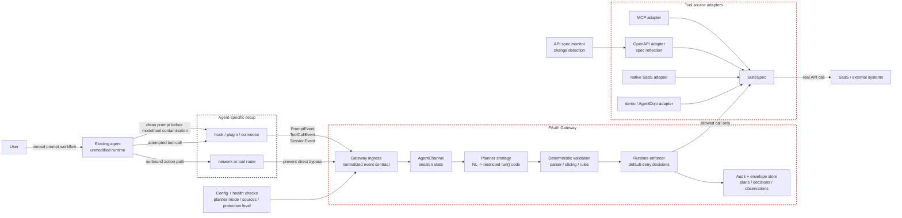

# 設計状況

本書は現在の gateway 設計を記述し、それを、まだ検討中の案、所与の制約下で技術的に
不可能と判断した点、主要な開発上のボトルネックと区別して整理する。

OSS としての提供形態と商用運用の様式は、本設計文書の対象外とする。

## 現在の設計

現在の構成は、エージェント側に置かれる認可 gateway である。エージェントの実行基盤
そのものには手を入れず、エージェントごとの連携層が、外向きの動作が実行される前に
タスクイベントとツールイベントを gateway へ転送する。

### 確定した構成

以下が確定した論理構成である。ホスティングの選択はこの図から意図的に除外している。
gateway は将来、localhost、利用者の VM、私設ネットワーク上のサービス、管理された
自己ホスト型パッケージのいずれで動かすこともありうるが、ここに示す論理境界は安定に
保たれるべきである。



確定事項から導かれる帰結:

- エージェントごとに専用の導入アダプタが必要になりうる。すべてのアダプタが同一の
  gateway イベント契約へ正規化する限り、それは許容できる。
- gateway の製品としての中核は Claude Code hook ではない。Claude Code は一つの
  アダプタにすぎない。
- バイパスを防ぐためにネットワーク経路の制御は必要だが、プロンプトイベントと
  ツールイベントも併せて捕捉しない限り、PAuth の執行には十分でない。
- ホスティングは運用上の判断である。Planner の論理、執行の論理、`SuiteSpec` に
  漏れ込んではならない。
- gateway は自身の実効的な保護レベルを報告しなければならない。プロンプト捕捉や
  経路制御を欠くとき、そのセッションを完全な PAuth 保護と称してはならない。

現在安定している境界:

| 境界 | 現在の契約 | リポジトリ内の対応箇所 |
|---|---|---|
| エージェント ingress | gateway メッセージ API 上の `PromptMessage` と `ToolCallMessage`。 | `gateway/ingress/agent_channel.py`, `gateway/serving/http_server.py` |
| 立案 | ユーザープロンプトとツールスキーマを、制限された命令型の `run()` コードへ変換する。 | `gateway/planning/planner.py`, `PLANNING_STRATEGIES.md` |
| 検証 | 生成されたコードは、執行の前に文法・スライス・ルールコンパイルを通過しなければならない。 | `pauth/grammar.py`, `pauth/pipeline.py`, `pauth/rules.py` |
| 執行 | すべてのツール呼び出しを、コンパイル済みルールと envelope に裏付けられた観測に照らして検査する。 | `pauth/enforcer.py`, `pauth/envelope.py` |
| ツール供給元 | ツール提供元は `SuiteSpec` に適合させる。 | `pauth/suites/base.py`, `gateway/providers/openapi_suite.py`, `gateway/providers/mcp_suite.py` |

実装済みの連携と提供元:

- Claude Code hooks は最初の ingress アダプタであり、製品の中核ではない。
- shopping suite はローカルで決定的に動く実演用スイートである。
- AgentDojo は `benchmarks/agentdojo_adapter.py` を介して、ベンチマーク／モック環境
  として使っている。
- MCP と OpenAPI の提供元は `SuiteSpec` に適合させられる。
- OpenAPI 仕様はツールスキーマへ反映でき、その変更は監視できる。

実装済みの Planner 戦略:

- `deterministic`: 既知のプロンプト様式に対する既定の認識器。
- `llm-freeform`: 文法修復の再試行と、任意で判定器の支援を伴う LLM によるコード
  生成。

登録済みだが未実装の Planner 枠:

- `interactive-structuring`
- `specialized-codegen`
- `formal-semantic`

現在の保護モデル(正準の定義はコード `gateway/runtime/protection.py` の
`ProtectionLevel` であり、以下はその人間向けの写しである):

| レベル | gateway が観測するもの | 主張できること |
|---|---|---|
| L0 | ネットワーク宛先のみ | 粗いファイアウォール。PAuth の保証はない。 |
| L1 | ツール呼び出しのみ | 未知・ポリシー外のツールは拒否できるが、タスクの意図は推定できない。 |
| L2 | 汚染されていないプロンプトとツール呼び出し | PAuth の計画執行が初めて意味を持つ。 |
| L3 | 汚染されていないプロンプトとツール呼び出しに加え、ツールを gateway が実行 | 現時点で最も強い到達目標。 |

製品は L3 を目指すべきだが、配備が L0・L1・L2 にとどまるときは、その旨を明示すべき
である。

## 検討中の改善

以下は見込みのある改善だが、まだ保証されておらず、完全には実装されていない。

### localhost 方式と隔離 VM 方式

配備先は意図的に未決のままにしている。問うべきは「小規模か大規模か」ではなく、
エージェントのプロセスをどれほど強く閉じ込める必要があるかである。

検討中の候補は二方式ある:

| 方式 | 形態 | 強み | 代償 |
|---|---|---|---|
| ローカル隣接方式 | エージェントと gateway を同じ利用者の計算機上で動かす。エージェント側のアダプタが `localhost` へイベントを送る。 | 導入の摩擦が小さい。OSS の最初の体験として最良。 | これ単体では、エージェントプロセスからの直接的なネットワークバイパスをすべて防ぐことはできない。 |
| 隔離エージェント方式 | エージェントを VM・コンテナ・サンドボックスの中で動かす。エージェントは gateway にしか到達できず、gateway が SaaS/API に到達する。 | エージェントの外部通信をより強く閉じ込められる。 | 導入が重い。OS や実行環境に依存する。最初から必須にすると OSS の普及を妨げかねない。 |

設計上の問いは次のとおりである:

```text
Should the default OSS experience optimize for low-friction local adoption, or
should the default security story require an isolated agent runtime?
```

現時点の傾き:

- 論理構成はエージェント隣接のまま保つ。
- VPC やクラウドへの配置を主要な枠組みにしない。
- 最初の利用者体験としては `localhost` を想定する。
- VM・コンテナ・サンドボックスによる隔離は、より強い封じ込め方式として扱う。
- **決定 (2026-07-08, Q10):** localhost 上でも、エージェントを**専用の非管理者
  ユーザー**で動かし、OS の egress 遮断 (`gateway/deploy/egress_lockdown.sh`) を
  適用すれば、**その外向き通信は必然的に gateway を通る**(通らないものはカーネルで
  破棄される)。したがって「localhost では経路を強制できない」はもはや正しくない
  ―― *非管理者ユーザーという前提の下では*強制できる。管理者権限を持つエージェント
  には無効であり(規則を外せる)、ネットワーク以外の副作用(ローカル FS など)は
  対象外である。これらは引き続き隔離方式(VM・コンテナ)の利点として残る。

主要な依存関係:

- 「OS レベルのエージェント権限管理」は、**専用の非管理者ユーザーと利用者別の
  egress ファイアウォール**という形の egress 遮断として具体化された (Q10)。承認済み
  のネットワーク宛先(= gateway)への制限はこれで達成される。残るのは、ファイル・
  資格情報・ツールの FS 側の隔離と、それが無効化されたことを検知する健全性検査で
  ある。
- したがって localhost 方式は、(非管理者ユーザーという前提の下での)egress 遮断、
  資格情報の隔離、アダプタによる経路づけ、健全性検査、バイパス危険の明示的な報告に
  依拠する。(ネットワーク以外の副作用にまで及ぶ)プロセス水準の完全な封じ込めは、
  依然として隔離方式の領分である。

この決定は、デーモン起動・健全性検査・バイパス検知を実装する際に見直すべきである。
最小限の実用製品はまず localhost を支え、より強い VM・コンテナ方式を厳格な
封じ込めへの道筋として文書化する形でよい。

### 二方式配備の開発モデル

localhost 版と隔離 VM・コンテナ版を別々のリポジトリにすべきではない。両者は同じ
gateway 構想の二つの配備方式である。リポジトリを分ければ、避けられたはずの設計の
乖離が生じる。Planner の挙動、イベント契約、執行の意味論、アダプタのスキーマ、監査
記録の形式を、手作業で同期させ続けることになる。

推奨する構造:

```text
single repository
  shared core:
    pauth/
    gateway planner
    gateway event contract
    SuiteSpec/tool adapters
    audit/envelope semantics

  deployment modes:
    local-adjacent mode
    isolated-agent mode
```

Git worktree は実装の分離に有用だが、恒久的な製品分割としてではなく、一時的な開発
作業場として使うべきである。

推奨する worktree 運用:

| Worktree | 目的 | 統合の規則 |
|---|---|---|
| `codex/local-adjacent-mode` | デーモン起動、localhost アダプタの使い勝手、ローカルの健全性検査。 | イベント契約と執行の中核は共有のまま保つ。 |
| `codex/isolated-agent-mode` | VM・コンテナのサンドボックス設定、gateway のみに限る外向き経路、より強いバイパス統制。 | 同じ gateway プロトコルとポリシーエンジンを再利用する。 |

概念モデルを分岐させないこと:

- `PromptEvent`・`ToolCallEvent`・`SessionEvent` は共有のまま保つ。
- Planner 戦略は共有のまま保つ。
- PAuth の検証と執行は共有のまま保つ。
- ツールアダプタは可能な限り共有のまま保つ。
- 配備固有のコードは周縁に置く。起動スクリプト、サンドボックス設定、インストーラの
  使い勝手、経路の強制、健全性検査などである。

実務上の規則: worktree は、現在の設計基線をコミットしてから作ること。未コミットの
変更が残る作業ツリーから worktree を作ると、古い `HEAD` から分岐し、実装が始まる
前から二方式が乖離してしまう。

### エージェント非依存の ingress

gateway は単一の捕捉機構を標準にすべきではない。標準にすべきは単一のイベント契約で
ある。

想定されるアダプタの形:

```text
Claude Code hook          ┐
Codex hook/plugin         ├─> PromptEvent / ToolCallEvent / SessionEvent
MCP/session adapter       │
browser/desktop adapter   │
custom agent adapter      ┘
```

つまり各エージェントには依然として導入作業が必要だが、gateway は正規化の後は
すべてを同一に扱える。

必要な次の一歩: 現在の `PromptMessage` と `ToolCallMessage` の通信上の形を、
`session_id`、`source`、`captured_before_model`、`protection_level`、バイパス・
健全性の状態といった項目を含む、明示的な Gateway Integration Contract へ昇格させる
こと。

### より簡便な導入

現実的に最良の導入体験は次のとおりである:

1. エージェント固有のアダプタを導入・有効化する。
2. gateway の URL を設定する。
3. 登録済みのツール／API 呼び出しを gateway 経由に経路づける。
4. プロンプト捕捉とツール経路づけが有効であることを健全性検査で確認する。

さらに簡便な変種もありうる:

- 一つのコマンドで済むローカルインストーラ。
- Claude Code hook 設定の自動生成。
- Codex プラグイン／コネクタのパッケージ化。
- すでに MCP ツールを使っているエージェント向けの MCP プロキシ方式。
- ライフサイクル hook を持たないエージェント向けのブラウザ／デスクトップアダプタ。
- アダプタの状態、Planner の動作方式、接続済みの SaaS 仕様を確認できる自己ホスト型
  の UI。

簡便化の層が保護レベルを隠してはならない。黙って L0 に落ちる滑らかな導入は、実際に
何が保護されているかを利用者に告げる明示的な導入より悪い。

### Planner 戦略の発展

A1 のプロンプトからコードへの層は、意図的に差し替え可能にしてある。

候補となる戦略の路線:

- `interactive-structuring`: 利用者に的を絞った質問をし、構造化されたプロンプトを
  組み立ててから、コードを生成する。
- `specialized-codegen`: 制限された命令型コードに特化したモデルを、検証器主導の
  再試行と併せて使う。
- `formal-semantic`: 統制された自然言語を意味形式へ解析し、そのうえで制限された
  命令型コードを出力する。

不変条件は、どの戦略も依然として制限された `run()` コードを出力し、決定的検証を
通過しなければならないことである。PAuth の中核を意図して設計し直さない限り、
いかなる戦略もルールを直接出力すべきではない。

### API 仕様の反映

OpenAPI の反映は基盤として実装済みだが、利用者に見える更新の一巡は未着手である。

将来望まれる挙動:

1. 上流の API 仕様変更を検知する。
2. 追加・削除・変更されたツールと引数を利用者に提示する。
3. 危険な変更には、承認またはポリシーの見直しを必須にする。
4. 承認されたツール面で gateway を再読み込みまたは再起動する。
5. 承認済みの仕様の版を監査用に永続化する。

現在の制約: 監視器は差分を出力するが、稼働中の gateway はまだ承認済みの変更を動的
に再読み込みしない。

## 現在の制約下では技術的に不可能な事項

以下の点は、制約が変わらない限り、将来の計画項目ではなく棄却済みの主張として扱う
べきである。

### 導入作業なしの全エージェント対応

あらゆるエージェントに共通する hook の標準は存在しない。エージェントがプロンプト、
ツール呼び出し、経路づけ可能なツール境界を公開しないなら、gateway は PAuth の執行
に必要なデータを観測できない。

したがって、次は成り立たない主張である:

```text
Install the gateway once and it automatically protects every agent with no
agent-specific setup.
```

擁護できる主張は次のとおりである:

```text
For agents with a compatible adapter or routeable tool boundary, the gateway
normalizes prompt/tool events and enforces task-scoped authorization before
SaaS/API execution.
```

### ネットワークプロキシ単体によるユーザー意図の復元

ネットワークプロキシは宛先を、場合によっては要求本文も観測できる。しかし次のものを
確実に再構成することはできない:

- モデルの推論より前の、汚染されていないユーザープロンプト。
- 意味のあるツール名。
- 構造化されたツール引数。
- その呼び出しが元のタスクに属するのか、後から注入された目標に属するのか。

ネットワークのみの配備は、プロンプト／ツールイベントの捕捉と組み合わせない限り
L0 である。

### プロンプトからのコード生成による完全な安全性

PAuth は生成された計画を執行できる。しかし、生成された計画が利用者の真の意図を
完全に捉えていることは証明しない。

検証器の再試行は、構文上の妥当性と、制限言語としての妥当性を証明できる。しかし
それだけでは意味上の忠実さを証明できない。「完全な安全性」を匂わせる文言は、
いずれも技術的に偽である。

### 実行経路を制御しないままの完全なバイパス防止

エージェントが SaaS を直接呼べる、任意のシェル／ネットワークコマンドを実行できる、
あるいは観測されていない資格情報の経路を使えるなら、gateway はバイパスされうる。

gateway が執行できるのは、観測され制御された経路を通る動作だけである。

### エージェント内部の改変を既定の製品戦略とすること

特定のエージェントを分岐・改変することは実験には有用でありうるが、エージェント
非依存の保護という製品上の立場を支えない。最後の手段またはベンチマーク技法に
とどめるべきで、主たる連携戦略にすべきではない。

## 開発上のボトルネック

### 1. 連携契約の形式化が不十分

コードには `PromptMessage` と `ToolCallMessage` があるが、製品には安定した外部契約
が必要である。それがなければ、新しいアダプタが現れるたびに細部を独自に発明し、
gateway はエージェント固有の挙動へ流れていく。

優先順位:

1. `PromptEvent`・`ToolCallEvent`・`SessionEvent` と、健全性・バイパスのイベントを定義する。
2. 契約に版を付ける。
3. アダプタの適合試験を加える。

### 2. プロンプト捕捉が製品上の主要な危険

最難関は、もう一つプロキシを書くことではない。難しいのは、モデルやツールの結果に
汚染される前のプロンプトを、異なるエージェントを横断して捕捉することである。

プロンプト捕捉が弱ければ、系は L2/L3 から L1/L0 へ落ち、PAuth の中核的な主張が
崩れる。

### 3. A1 の意図忠実性は未解決

現在の決定的 Planner の守備範囲は狭い。現在の LLM Planner は、意図が失われたまま
でも文法検証を通過しうる。

これが研究上の中心的なボトルネックである。検証器の成功は、意図忠実性の成功とは
分けて測定しなければならない。

### 4. 実 SaaS の状態と資格情報はまだ本番水準にない

実演用・ベンチマーク用のスイートでは足りない。実際の配備には次が必要である:

- 資格情報の保管 → 🟡 方針決定済み(S4: ブローカーを採用)。実装は最初の実 SaaS
  連携時。
- 利用者ごとのツール登録 → 🔴 未実装(利用者モデルが必要)。
- envelope の永続化 → ⚪ 意図して非永続(session_store は再構成のための入力のみを
  保存する。B1)。
- 監査ログ → 🟢 ファイルへの永続化は実装済み(`http_server --audit-log`、JSONL
  追記、運用者向け)。ローテーション・集約は未実施。
- 提供元固有のエラー処理 → 🔴 未実装。
- API 仕様変更時の安全な再読み込み → 🔴 未実装(認証付きの再読み込みエンドポイント
  が必要)。

### 5. バイパスとサイドチャネルの方針が不完全

Claude Code のようなエージェントは、シェル、ファイルシステム、子プロセス、
ネットワークというサイドチャネルを持ちうる。ツール呼び出しの執行だけでは、これらの
経路を覆えない。**一部は 2026-07-08 に対処済み(下記)。**

製品に必要な明示的方針と、その現状:

- シェルコマンドの許可・拒否 → **🟢 実装済み**(`SideChannelPolicy` の既定拒否、
  S21。ただし「gateway を通った呼び出し」に限る。名前空間付きのものも捕捉される)。
- 外向きネットワークの制限 → **🟢 実装済み**(OS の egress 遮断
  `gateway/deploy/egress_lockdown.sh`、Q10。非管理者ユーザーという前提の下で、
  外向き通信を gateway 経由に強制する)。
- 資格情報の隔離 → 🟡 方針決定済み(S4: ブローカーを採用)。実装は最初の実 SaaS
  連携時。
- 未知のツールに対する既定の挙動 → 🟢 既定拒否(PAuth 中核)。
- 観測可能な健全性検査 → 🟡 実装済み(`GET /health` に加え、値を含まない保護
  レベル、計画の有無、ルール数、保留中の確認数を返す `GET /sessions/<id>`)。
  無効化された hook や SaaS への直接呼び出しの*能動的*検知(ハートビートなど)は
  未実装。
- **ネットワーク以外の副作用(ローカル FS の改竄、秘密情報の設置)に対する FS 側の
  隔離** → 🔴 未実装(egress 遮断の範囲外。隔離方式か FS サンドボックスが必要)。

### 6. 評価はモックスイートの先へ進まなければならない

AgentDojo は有用だが、製品の主張を検証するには足りない。

次の評価層には以下が必要である:

- 実際の SaaS API、または現実に即した SaaS API。
- 複数のエージェントアダプタ。
- 導入失敗の事例。
- プロンプト捕捉の順序に関する試験。
- バイパスの試行。
- 保護レベルごとの偽陽性・偽陰性の測定。

## 文書化に関する当面の規則

構成に関する文書を更新するときは、次の区分を分けて保つこと:

1. **現在の設計**: 実装済み、またはコードに直接表現されているもの。
2. **検討中の改善**: 見込みはあるが保証されていないもの。
3. **技術的に不可能**: 現在の制約下で棄却されたもの。
4. **開発上のボトルネック**: 製品の主張を妨げている作業。

これらの区分を混ぜると、設計が実際より成熟して見え、偽りの製品主張につながる。
