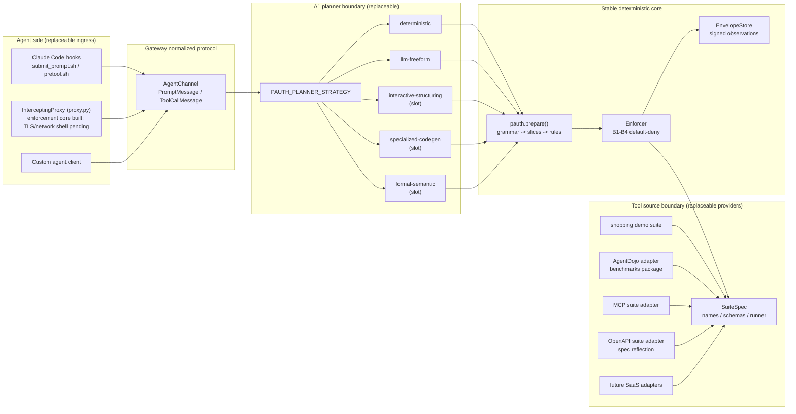
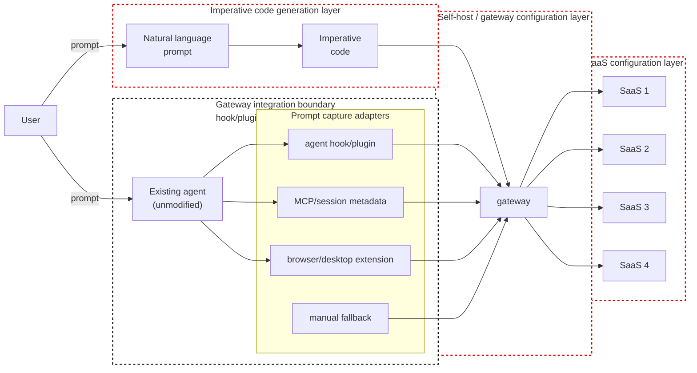

# architecture

A PAuth-based, no-modification-required task-scoped authorization gateway for
agents (Claude Code is the first target). This document describes the
system-level design that the `pauth/`, `gateway/`, and `tests/` implementations
embody. The current design status, unimplemented ideas, rejected claims, and
development bottlenecks are separated out into `design-status.md`.

## 1. System overview

```
       ┌──────────┐
       │   USER   │
       └────┬─────┘
            │ types prompt
            ▼
   ┌─────────────────────────────────────────────────────────────────┐
   │                       Claude Code (UNMODIFIED)                  │
   │                                                                 │
   │   ┌──────────────────┐                  ┌────────────────────┐  │
   │   │ UserPromptSubmit │ ─── hook ───────►│ submit_prompt.sh   │  │
   │   │  (harness event) │                  └──────────┬─────────┘  │
   │   └──────────────────┘                             │            │
   │            │                                       │ HTTP POST  │
   │            ▼ LLM reasoning                         ▼            │
   │   ┌──────────────────┐                  ┌────────────────────┐  │
   │   │  tool decision   │ ─── hook ───────►│ pretool.sh         │  │
   │   │  (PreToolUse)    │                  └──────────┬─────────┘  │
   │   └──────────────────┘                             │            │
   │                                                    │ HTTP POST  │
   └────────────────────────────────────────────────────┼────────────┘
                                                        ▼
   ┌─────────────────────────────────────────────────────────────────┐
   │              gateway/serving/http_server.py  (long-running daemon)      │
   │                                                                 │
   │   POST /sessions/<id>/messages   -- prompt OR tool_call         │
   │                                                                 │
   │            ┌─────────────────────────────────────────────┐      │
   │            │            gateway.AgentChannel             │      │
   │            │  - one channel per Claude Code session_id   │      │
   │            │  - enforces "prompt first, exactly once"    │      │
   │            └────────────────────┬────────────────────────┘      │
   │                                 │                               │
   │                                 ▼                               │
   │            ┌─────────────────────────────────────────────┐      │
   │            │           gateway.Gateway                   │      │
   │            │  submit_user_prompt(prompt)     plan ONCE   │      │
   │            │  handle_tool_call(tool, args)   enforce ALL │      │
   │            └────────┬────────────────────────┬───────────┘      │
   │                     │ A1 → A2 → A3           │ B1 – B4          │
   │                     ▼                        ▼                  │
   │            ┌────────────────┐       ┌───────────────────┐       │
   │            │  pauth library │       │ suite runner      │       │
   │            │  (algorithm)   │       │ (real tool exec)  │       │
   │            └────────────────┘       └─────────┬─────────┘       │
   │                                               │                 │
   └───────────────────────────────────────────────┼─────────────────┘
                                                   │ real call
                                                   ▼
                                  ┌─────────────────────────────────┐
                                  │ SaaS / external system          │
                                  │ (shopping demo today;           │
                                  │  banking / slack / gmail / etc. │
                                  │  via per-user registration      │
                                  │  later)                         │
                                  └─────────────────────────────────┘
```

## 1.1 Loose-coupling map

The gateway should stay stable while three highly volatile areas are free to
move:

1. how agent traffic enters the gateway;
2. how a user prompt becomes restricted imperative code;
3. which real app / mock suite / SaaS backend provides the tools.

These areas are intentionally separated by small contracts.



### Coupling boundaries

| Boundary | Contract | Replaceable parts | Stable owner |
|---|---|---|---|
| Agent ingress | `PromptMessage` and `ToolCallMessage` | Claude hooks, InterceptingProxy (`gateway/serving/proxy.py`, enforcement core implemented, TLS/network shell pending), custom client | `gateway/ingress/agent_channel.py` |
| Planner | restricted imperative `def run(...): ...` | deterministic recognizer, LLM free-form, interactive structuring, specialized model, formal parser | `gateway/planning/planner.py` |
| Tool source | `SuiteSpec` (`tools`, `make_env`, `runner_factory`) | shopping demo, AgentDojo, MCP servers, OpenAPI specs, future SaaS adapters | `pauth/suites/base.py` |
| Authorization core | compiled rules + envelope-backed operand checks | should not change per provider | `pauth/` |

**Terminology note — "ingress" here refers only to the *adapter* level.** In
this map, "Agent ingress" refers to *which adapter* connects the agent (hooks /
proxy / custom client), all of which are normalized into `PromptMessage` /
`ToolCallMessage`. This does **not** describe the wire-level direction of
capture vs. enforcement. The round-trip segment model (outbound/return ×
ingress/egress — where the prompt is observed, where the tool call is observed,
and the single segment where enforcement can act) is defined in the
"Directional model" of `ingress-design.md`. Keep these two vocabularies
distinct: "ingress" in this document = adapter, while return-path egress in that
document = enforcement tap. They are not synonyms.

AgentDojo belongs behind the **Tool source** boundary. It is a provider used in
the benchmark and mock environment, not the center of the architecture. If real
apps replace AgentDojo, they should implement or adapt to `SuiteSpec`; the PAuth
core and planner contract should not know whether the tools behind them come
from AgentDojo, MCP, OpenAPI, or a hand-written suite.

OpenAPI-backed providers add one more operational loop:
`gateway/providers/openapi_suite.py` reflects the spec at load time, and
`gateway/providers/api_spec_monitor.py` detects spec changes and emits a
notification-ready diff. The gateway should not silently absorb upstream API
changes without surfacing the changed tool surface to the user.

## 1.2 Reference mental model

This is a working mental model derived from the user's white-background sketch
(`cloud local.pdf`, shared 2026-06-09). In future design discussions, keep these
three red-dotted zones separated.



Interpretation:

| Red-dotted zone | Meaning | Anchor in the current repository |
|---|---|---|
| Imperative code generation layer | The unsolved A1 problem: from natural language to restricted `run()` code. | `gateway/planning/planner.py`, `planning-strategies.md`, `pauth/codegen.py`, `gateway/planning/agentic_a1.py` |
| Self-host / gateway configuration layer | How the user runs/configures the gateway, selects a planner strategy, manages sessions, reloads changed specs, and receives audit/notification output. | `gateway/serving/http_server.py`, `gateway/serving/config.py`, `self-hosting.md`, `gateway/providers/api_spec_monitor.py` |
| SaaS configuration layer | How real apps / SaaS APIs are registered, reflected, monitored, and adapted into a `SuiteSpec`. | `pauth/suites/base.py`, `gateway/providers/mcp_suite.py`, `gateway/providers/openapi_suite.py`, `gateway/providers/registry.py` |

The black-dotted zone surrounding the existing agent represents the gateway
integration boundary: lifecycle hooks/plugins forward the clean prompt and
attempted tool calls, while network/tool routing prevents bypass. The existing
agent itself is intentionally outside the red design zones. The product goal is
to keep the agent's runtime and the user's day-to-day workflow unmodified after
setup, while moving the variability into the gateway ingress, planner strategy,
and tool-source adapters. (Here "ingress" = the adapter level; for the
wire-level outbound/return × ingress/egress segment model, see the "Directional
model" of `ingress-design.md`.)

Prompt capture is adapter-based. The signals each agent exposes differ, but
every capture path must be normalized into a `PromptMessage` before reaching
`AgentChannel`. The design target is not one universal prompt hook but one
universal prompt-event contract.

## 2. Component responsibilities

| Component | Responsibility |
|---|---|
| `pauth/` | The pure PAuth algorithm. `codegen` (A1 LLM prompt), `grammar` (Appendix A parser), `slicing` (A2), `rules` (A3, Algorithm 1), `enforcer` (B1–B4), `envelope` (signed observations), `evaluator` (deterministic symbolic evaluation), `suites/base` (SuiteSpec interface). Has no knowledge of the agent, hooks, or HTTP. |
| `pauth/suites/shopping.py` | A self-contained demo suite: tools, environment, runner, plus worked-example reference code / task definitions. Used both for paper reproduction (`tests/`) and the gateway demo. |
| `gateway/planning/core.py` | The NL → run() recognizer (deterministic, regex-driven). Used only on the strict path; the agentic/freeform path skips it. |
| `gateway/planning/planner.py` | The pluggable A1 boundary. A planner strategy emits restricted imperative code, and `Gateway` compiles and enforces it via the stable PAuth pipeline. |
| `planning-strategies.md` | The A1 strategy catalog: interactive structuring, a specialized imperative-code model, formal NL parsing. |
| `gateway/planning/agentic_a1.py` | The LLM A1 with a grammar-feedback loop (Q12). Wraps `pauth.codegen.SYSTEM_PROMPT`, catches `RestrictedGrammarError`, feeds the violated rule back to the LLM, and retries up to N times. |
| `gateway/runtime/gateway.py` | The `Gateway` class. Holds one task lifecycle. Two entry points: `submit_user_prompt(prompt)` (plan once) and `handle_tool_call(tool, args)` (enforce per call). |
| `gateway/ingress/agent_channel.py` | The agent-facing API. Two message kinds: `prompt` and `tool_call`. Structurally enforces "prompt first, exactly once". A JSON-serializable wire shape. |
| `gateway/serving/http_server.py` | A minimal stdlib HTTP wrapper. `POST /sessions/<id>/messages`. Sessions are keyed by a client-supplied id (Claude Code's session_id). |
| `gateway/hooks/` | `submit_prompt.sh` (UserPromptSubmit) and `pretool.sh` (PreToolUse). Thin curl-to-HTTP shims, each with a strict / log mode. |
| `tests/` | Paper reproduction (`tests/test_worked_examples.py`, `tests/test_unexpected_attacks.py`, `tests/experiment/`) and L1/L2/L3 fixtures (`tests/fixtures/`). |

## 3. Data flow (one task lifecycle)

```
                    User prompt
                         │
        (1) UserPromptSubmit hook fires before the LLM sees the prompt
                         │
                         ▼
                 HTTP /sessions/<id>/messages
                 { "kind": "prompt", "prompt": "..." }
                         │
            ┌────────────┴───────────┐
            │ AgentChannel.receive   │
            │  - first prompt? OK    │
            │  - second prompt? ERR  │
            └────────────┬───────────┘
                         │
                         ▼
         Gateway.submit_user_prompt(prompt)
                         │
            ┌────────────┴────────────┐
            │ gateway.planner         │
            │  - deterministic        │   strict path
            │    recognizer           │
            │  - agentic LLM + repair │   freeform path
            │  - future planner       │   self-hosted app
            └────────────┬────────────┘
                         │
                         ▼
              pauth.prepare(code)
              ├─ grammar.parse_and_validate
              ├─ slicing.derive_slices     (A2)
              └─ rules.compile_rules       (A3)
                         │
                         ▼
                Session = { rules, env, store, runner }
                         │
                         │
   ─── now Claude Code's LLM starts; on every tool call: ───
                         │
                         ▼
                 PreToolUse hook fires
                         │
                         ▼
                 HTTP /sessions/<id>/messages
                 { "kind": "tool_call",
                   "tool": "...",
                   "kwargs": { ... } }
                         │
                         ▼
         AgentChannel resolves kwargs → schema-ordered args
                         │
                         ▼
         Gateway.handle_tool_call(tool, args)
                         │
            ┌────────────┴────────────┐
            │ Enforcer.check          │ B1, B2, B3 (paper)
            │  - rule exists?         │
            │  - guards satisfied?    │
            │  - operands match       │
            │    envelopes?           │
            └────────────┬────────────┘
                         │ permitted
                         ▼
               suite.runner(tool, kwargs)   real SaaS call
                         │
                         ▼
               wrap result + record envelope (B4)
                         │
                         ▼
               return result to agent
```

## 4. Hard invariants

These are enforced by code, not by convention.

1. **Plan once**. `Gateway.submit_user_prompt` can be called only once per
   session. `AgentChannel` rejects a second `PromptMessage`. The gateway never
   re-plans based on agent input.

2. **A tool call requires a preceding prompt**. `AgentChannel._handle_tool_call`
   returns an `ErrorResponse` if no prompt has been submitted.

3. **The gateway is the authority on observations**. The result of every
   permitted tool call is executed by `suite.runner` (the gateway, not the
   agent) and recorded as an HMAC-signed envelope in the gateway-owned
   `EnvelopeStore`. Because operand verification reads from this store, an agent
   that reports fabricated intermediate values cannot influence subsequent
   operand checks.

4. **Default-deny**. `Enforcer.check` rejects every call that has no
   exact-matching rule (paper sec. 5.2). The rejection reason is surfaced
   verbatim to the caller for auditability.

5. **Single signing root**. The gateway owns the keyring. Envelopes are signed
   by the gateway, not by individual SaaS servers. The transcript calls this a
   "personal client-side task-scoped firewall" -- it trades the paper's
   per-server autonomy for a single deployable artifact.

## 5. Threat model

What the gateway defends against:

| Threat | Defended by |
|---|---|
| The agent issues a tool call that is not in the user-derived plan | Default-deny on missing rule (B1) |
| The agent inflates / swaps a constant operand (recipient IBAN, amount, subject, date) | Operand match against compiled rules (B2/B3) |
| The agent fabricates a derived value (e.g. a `cart.total` it never observed) | Symbolic evaluation against the envelope store; agent-reported values are ignored (B3) |
| The agent omits the observation tool and tries to use its symbolic result | Envelope missing → operand unresolved → denial |
| The agent calls a sensitive tool out of order | Guard evaluation requires upstream envelopes; missing → deny |
| The agent re-plans mid-session (e.g. during injection) | `AgentChannel` rejects second `PromptMessage` |
| Tool-result injection (paper sec. 3, AgentDojo's threat model) | Plan was generated from the clean user prompt before any tool output existed; injected actions are off-plan |

What the gateway does **not** defend against (explicitly out of scope):

| Threat | Reason |
|---|---|
| Injection embedded in the user's prompt itself | The UI / input window is trusted (the user's responsibility). See Q11. |
| The agent silently alters the prompt during the forwarding step | A new trust assumption introduced by hook routing (Q13). Mitigation: `UserPromptSubmit` runs before the LLM sees the prompt, so the LLM cannot alter it. |
| The agent bypasses the hook (e.g. the user disables it) | The user is trusted (Q0). |
| Side channels (file system, child processes, environment variables) | The gateway only sees tool calls. A real Claude Code firewall additionally needs a Bash command policy and/or a sandbox; see Q7 / Q10. |
| Prompt-correctness (does the plan actually capture the intent?) | PAuth is an authorization layer, not a correctness oracle. The user can approve a plan that does the wrong thing -- enforcement only guarantees that the agent stays inside that plan. |

## 6. Key design decisions and where to find them

| Decision | Location |
|---|---|
| Plan once, enforce per call | gateway/runtime/gateway.py docstring; Q12 derivation |
| Recognizer-canonical path vs LLM A1 | gateway/planning/planner.py, gateway/planning/core.py, gateway/planning/agentic_a1.py; Q9, Q12 |
| Grammar feedback loop with explicit "you MUST obey rule X" | gateway/planning/agentic_a1.py; Q12 answer |
| Agent-facing channel and trust shift | gateway/ingress/agent_channel.py; Q13 |
| Self-hosted, user-registered SaaS | self-hosting.md; not yet implemented |
| Test data layered into L1 / L2 / L3 | tests/fixtures/; user discussion 2026-06-04 |
| AI-generated fixtures separated for review | tests/fixtures/ai_generated/ |

## 7. Operational notes

* Start the gateway daemon (`gateway/serving/http_server.py`) before opening
  Claude Code. The daemon holds session state in memory; restarting it loses all
  active sessions.
* Hook scripts log to stderr; Claude Code surfaces stderr into its own
  transcript.
* `GATEWAY_MODE_PROMPT=strict` blocks Claude Code on a rejected prompt.
  `GATEWAY_MODE_TOOL=log` is the current default for tool calls -- switch it to
  `strict` once the set of tools to enforce is finalized.
* On the freeform LLM A1 path, the user prompt must contain enough literal
  constants (IBAN, subject, date, etc.) for the recognizer or LLM to generate a
  usable run(). Under-specified prompts are rejected by design.

## 8. Multi-suite / pluggable tool sources

The gateway operates on a single ``SuiteSpec``, but
``gateway/providers/registry.py`` composes a *virtual* ``SuiteSpec`` merged from
an arbitrary number of source suites. Tool names must be globally unique; the
registry validates this at registration time.

Current pluggable backends:

| Backend | File | Use |
|---|---|---|
| Self-contained shopping suite | `pauth/suites/shopping.py` | Demos, offline tests |
| AgentDojo suites | `benchmarks/agentdojo_adapter.py` | Paper reproduction, banking/slack/travel/workspace |
| MCP server (HTTP) | `gateway/providers/mcp_suite.py` ``build_mcp_suite`` | Localhost MCP shims, real MCP servers that expose HTTP |
| MCP server (stdio) | `gateway/providers/mcp_suite.py` ``build_mcp_suite_stdio`` | Reference MCP servers (``@modelcontextprotocol/*``) and similar subprocess shapes |

Additional shaping layers:

* `gateway/runtime/policy.py` -- ``PolicyAwareEnforcer`` lets the deployer mark
  ``(tool, parameter)`` pairs as *free* operands, and the enforcer skips the
  operand check there. Used for search queries, free-form message bodies, and
  similar operands that carry no transactional meaning.
* `gateway/providers/suite_filter.py` -- a bag-of-words ``SuiteFilter`` that
  narrows the merged universe to a subset scored against the prompt. Keeps the
  A1 prompt small when many MCPs are registered. The scorer is pluggable.
* `gateway/serving/config.py` -- the JSON config consumed by the HTTP server's
  ``--config`` flag. Declares the source suites, operand policy, and suite
  filter parameters. Thanks to the adapter table, adding a new backend takes a
  single function.

## 9. Deployment topology

Two deployment shapes are described here. The self-hosted shape is the near-term
target; the managed-cloud shape is an aspirational version kept in mind so the
abstractions do not paint us into a corner.

### 9.1 Self-hosted on Sakura, managed by Monocle (near-term)

```
                         ┌──────────────────────┐
                         │  USER (laptop / SSH) │
                         └──────────┬───────────┘
                                    │  ssh / web shell
                                    ▼
   ┌─────────────────────────────────────────────────────────────────┐
   │ Sakura Internet VM   (provisioned and managed by Monocle)       │
   │                                                                 │
   │  ┌─────────────────────────────────────────────────────────┐    │
   │  │  systemd unit: claude-code                              │    │
   │  │   └─ hooks: submit_prompt.sh / pretool.sh               │    │
   │  └────────────┬────────────────────────────────────────────┘    │
   │               │ localhost HTTP (127.0.0.1:8081)                 │
   │               ▼                                                 │
   │  ┌─────────────────────────────────────────────────────────┐    │
   │  │  systemd unit: gateway-http                             │    │
   │  │   - gateway/serving/http_server.py --config /etc/gateway.json   │    │
   │  │   - in-memory sessions, restart loses state             │    │
   │  └────────────┬────────────────────────────────────────────┘    │
   │               │                                                 │
   │     ┌─────────┴───────────────────────┐                         │
   │     │ stdio subprocess MCPs           │ HTTP MCPs              │
   │     ▼                                 ▼                         │
   │  ┌────────────────────┐   ┌────────────────────────────────┐    │
   │  │  @mcp/filesystem,  │   │  internal MCP HTTP shims,      │    │
   │  │  @mcp/git, etc.    │   │  bound to 127.0.0.1            │    │
   │  └────────────────────┘   └─────────────┬──────────────────┘    │
   │                                         │ outbound HTTPS         │
   └─────────────────────────────────────────┼────────────────────────┘
                                             │
                                             ▼  (Sakura egress, private route preferred)
                                ┌────────────────────────┐
                                │  public SaaS APIs       │
                                │  (Gmail, Linear, ...)   │
                                └────────────────────────┘
```

Operational choices:

* **1 VM, 1 gateway, 1 user.** Multi-tenancy is out of scope at this stage.
  Session isolation is by Claude Code's ``session_id``.
* **State.** Sessions live in process memory. They are lost on
  ``systemctl restart``. Acceptable as long as the user can simply resubmit the
  prompt; revisit once long-running tasks become real.
* **Secrets (credential broker model, S4).** The gateway **holds and executes**
  the SaaS credentials. To make L3 work (where the gateway executes the tool
  itself and records a signed envelope), the gateway, as the executing party,
  must hold the credentials. The old model that separates the execution point
  from the enforcement point ("the gateway never sees the API key") is
  incompatible with L3 and has been dropped. The risk of becoming a
  key-aggregation point is accepted by assuming this self-hosted shape (1 VM /
  1 user running on the user's own VM). Broker implementation requirements:
  per-suite isolated storage, rotation, access audit. (Implementation happens
  together with the first real SaaS integration.)
* **Network.** ``gateway-http`` binds to ``127.0.0.1``, so the HTTP API is not
  reachable from outside the box. Hooks are local, so they can reach it. There
  is no TLS on the local hop. Outbound to public SaaS uses Sakura's standard
  egress, together with the private route that Monocle exposes.
* **Logging / observability.** The gateway and hook scripts write to stderr;
  systemd's journal captures it, and Monocle aggregates the journal.
* **Backup / restore.** Sessions are ephemeral. Config and suite registration
  are flat files; Monocle's VM image handling covers them.
* **Update.** The application is Python source on the VM. Applying an update is
  ``git pull`` + ``systemctl restart gateway-http`` and (if the hook scripts
  changed) reloading Claude Code's settings.

Trade-offs against the managed-cloud shape:

* (+) Cheap, entirely under our control, low-latency hook calls.
* (+) No vendor lock-in; the whole stack is files on a Linux VM.
* (-) Single point of failure; 1 VM down = Claude Code unavailable.
* (-) Manual scaling. Enough for 1 user, does not hold up for many.
* (-) Restart loses sessions.

### 9.2 Managed cloud (AWS or Azure, aspirational)

The same codebase; a different set of operational characteristics. AWS and Azure
are both sketched so that the abstractions inside `gateway/` stay portable.

```
                                  ┌──────────────────────┐
                                  │ USER (browser/IDE)   │
                                  └──────────┬───────────┘
                                             │ HTTPS / SSO
                                             ▼
                              ┌───────────────────────────────┐
                              │  Edge / WAF                   │
                              │  (CloudFront + WAF /          │
                              │   Front Door + WAF)           │
                              └──────────────┬────────────────┘
                                             │
   ┌─────────────────────────────────────────┼──────────────────────────┐
   │ private VPC / VNet                                                 │
   │                                                                    │
   │   ┌────────────────────────────────────────────────────────────┐   │
   │   │  Claude Code container (ECS Fargate / Container Apps)      │   │
   │   │  - hooks call the gateway over the private VPC             │   │
   │   │  - one task per user session (autoscaled)                  │   │
   │   └────────────────────────┬───────────────────────────────────┘   │
   │                            │ private DNS                            │
   │                            ▼                                        │
   │   ┌────────────────────────────────────────────────────────────┐   │
   │   │  Gateway service                                           │   │
   │   │  - Fargate / Container Apps autoscaled stateless workers   │   │
   │   │  - reads session state from managed KV                     │   │
   │   │  - reads config + secrets from Secrets Manager / Key Vault │   │
   │   └─────────┬────────────────────┬─────────────────────────────┘   │
   │             │                    │                                  │
   │             ▼                    ▼                                  │
   │   ┌────────────────────┐  ┌────────────────────────┐                │
   │   │ Session KV         │  │ Secrets / Config        │               │
   │   │ DynamoDB / Cosmos  │  │ Secrets Manager / KV    │               │
   │   └────────────────────┘  └────────────────────────┘                │
   │                                                                    │
   │   ┌─────────────────────────────────────────────────────────────┐  │
   │   │ MCP shims                                                   │  │
   │   │ - per-suite Lambdas / Functions (or sidecar containers)     │  │
   │   │ - hold per-user OAuth tokens issued via the SaaS provider   │  │
   │   └──────────────────────────┬──────────────────────────────────┘  │
   │                              │ VPC NAT / private endpoint           │
   └──────────────────────────────┼──────────────────────────────────────┘
                                  ▼
                       ┌────────────────────────┐
                       │ public SaaS APIs        │
                       └────────────────────────┘
```

Operational choices:

* **Containers, not Lambda/Functions, for the gateway hot path.** Hooks block
  Claude Code; serverless cold-start latency becomes visible to the user. Keep
  the gateway as a long-running container service. An MCP shim that wraps a
  single SaaS *can* be serverless, since the gateway keeps it warm.
* **Stateless gateway, managed session store.** Move ``AgentChannel``'s session
  state out of process memory into DynamoDB or Cosmos DB. Keyed by Claude
  Code's ``session_id``; the envelope / rules / plan blob is serialized to JSON.
  You lose the "in-memory speed" property; you gain horizontal scale and
  crash resilience.
* **Identity and isolation.** A per-user IAM role (AWS) or Managed Identity
  (Azure) on the Claude Code container. The gateway can only authorize SaaS
  calls against resources that role/identity is allowed to touch. Shrinks the
  blast radius if a user's token leaks.
* **Secrets (credential broker model, S4).** Per-user OAuth tokens live in
  Secrets Manager (AWS) / Key Vault (Azure) scoped by the user's identity, and
  **the gateway (broker) pulls them at call time to execute the tool**. Even
  when going through an MCP shim, the shim is a component under the gateway's
  control, and both the credential-fetch path and the execution path are kept
  inside the gateway's audit boundary.
* **Network.** Private VPC / VNet. Public access only via the edge WAF. Outbound
  to SaaS uses VPC NAT, or a Private Endpoint if the SaaS supports it. Logging
  includes an egress header, so traffic leaving the VPC is auditable.
* **Observability.** CloudWatch / Application Insights. Each tool call produces
  a structured event; permit/deny + reason are first-class fields, so a SIEM can
  spot anomalies.
* **Cost levers.** The gateway autoscales on RPS; MCP shims autoscale on
  per-suite QPS; the session KV is on-demand billed. Idle cost is bounded by the
  always-on gateway baseline.

Why not Vercel for the production hot path:

* Vercel's strength is serverless / edge functions for web frontends. The
  gateway's hooks are synchronous network calls from a long-running agent;
  serverless cold starts make the Claude Code experience unstable. Session state
  is global to the conversation; Vercel assumes per-request statelessness.
* Vercel *is* a good place for an admin UI or status dashboard layered on top of
  the gateway. Keep the hot path on container-based compute.

### 9.3 Mapping the codebase to the topology

| Abstraction | Self-hosted role | Cloud role |
|---|---|---|
| `gateway/serving/http_server.py` | systemd unit on the VM | container behind a private ALB / Application Gateway |
| `gateway/ingress/agent_channel.py` | unchanged | unchanged; session state is externalized at the `_Session` boundary |
| `gateway/providers/registry.py` + `gateway/serving/config.py` | `gateway.json` on disk | config blob in Secrets Manager / Key Vault |
| `gateway/providers/mcp_suite.py` HTTP | localhost MCPs | MCP services addressed by private DNS |
| `gateway/providers/mcp_suite.py` stdio | subprocess MCPs on the VM | sidecar containers or function-backed shims |
| `gateway/runtime/policy.py` | per-deployment JSON | per-tenant JSON in the config store |
| `gateway/providers/suite_filter.py` | unchanged | unchanged; consider an embedding-based scorer once the suite count grows |

The key invariant: **every abstraction sits above the deployment boundary**. The
gateway's algorithmic core (`pauth/`) and policy layer
(`gateway/runtime/policy.py`, `gateway/providers/registry.py`,
`gateway/providers/suite_filter.py`) are identical across topologies. Only the
operational substrate (state store, secret store, network) changes.

## 10. What is not built yet

* Real per-user SaaS registration UX (CLI / web UI). The config schema and MCP
  backends (HTTP + stdio) are in place; what is missing is the operator-facing
  flow to register the user's MCPs and OAuth tokens, especially in the cloud
  topology.
* An MCP server *wrapper* around `AgentChannel`. The current direction is Claude
  Code hooks → HTTP. A native MCP-server representation of the gateway is the
  right next move once Claude Code's native tool routing (rather than hooks)
  becomes the integration point.
* L3 reference fixtures for the AgentDojo suites. The types and one shopping
  family are in place (`tests/fixtures/l3_references.py` and
  `tests/fixtures/ai_generated/l3_references.py`); banking / slack / travel /
  workspace are still consumed via the existing AgentDojo adapter
  (`benchmarks/agentdojo_adapter.py`).
* An embedding-based suite filter. The keyword filter in
  `gateway/providers/suite_filter.py` is a cheap default, sufficient for a small
  number of MCPs; once registration exceeds ~20 suites, a small embedding model
  (or a cached LLM filter) starts to pay off.
* An externalized session store for the cloud topology. The in-memory
  `AgentChannel` session is the right default for a self-hosted VM; the cloud
  topology in §9.2 assumes a managed KV (DynamoDB / Cosmos) that is not yet
  implemented.
* Cross-file atomic checkpoint / agent-side rollback (Q2 γ'). Not needed yet,
  since the gateway itself does not mutate the agent's state.
