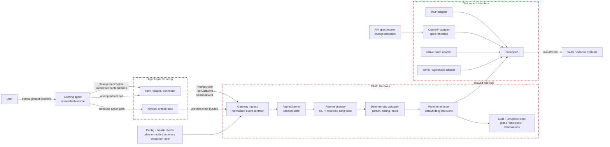

# Design status

このドキュメントは、現行の gateway 設計を、まだ議論中のアイデア、規定の制約下では
技術的に不可能と判断された点、そして主要な開発ボトルネックから切り分けて記述する。

OSS のパッケージングと商用運用の前提は `business-operations.md` に置く。

## Current Design

現行アーキテクチャは、エージェント側に立つ認可 gateway である。エージェント
ランタイム自体は改変しないが、エージェント固有の統合層が、外向きアクションが
実行される前にタスクイベントとツールイベントを gateway へ転送する。

### Confirmed Architecture

これは確定した論理アーキテクチャである。ホスティングの選択は意図的にこの図から
除外している。gateway は後に localhost、ユーザ VM、プライベートネットワーク
サービス、あるいはマネージドな自己ホストパッケージ上で動きうるが、これらの論理的
境界は安定して保たれるべきである。



確定した含意:

- 各エージェントはそれぞれ専用の setup adapter を必要としうる。すべての adapter が
  同一の gateway イベント契約へ正規化される限り、それは許容できる。
- gateway の製品コアは Claude Code hook ではない。Claude Code は一つの adapter に
  すぎない。
- ネットワークルーティングは bypass 防止には必要だが、プロンプトイベントとツール
  イベントも捕捉しない限り、PAuth 強制には十分ではない。
- ホスティングは運用上の決定である。それが planner ロジック、enforcement ロジック、
  あるいは `SuiteSpec` に漏れ出してはならない。
- gateway は自身の実効保護レベルを報告しなければならない。prompt capture または
  route 制御が欠けている場合、そのセッションを完全な PAuth 保護として訴求しては
  ならない。

現行の安定境界:

| Boundary | Current contract | Repo anchor |
|---|---|---|
| Agent ingress | gateway message API 上の `PromptMessage` と `ToolCallMessage`。 | `gateway/ingress/agent_channel.py`, `gateway/serving/http_server.py` |
| Planning | ユーザープロンプトとツールスキーマを、制限付き命令型の `run()` code へ変換する。 | `gateway/planning/planner.py`, `planning-strategies.md` |
| Validation | 生成された code は enforcement 前に文法・slicing・ルールコンパイルを通過しなければならない。 | `pauth/grammar.py`, `pauth/pipeline.py`, `pauth/rules.py` |
| Enforcement | すべてのツール呼び出しは、コンパイル済みルールと envelope 裏付けの観測に対して検査される。 | `pauth/enforcer.py`, `pauth/envelope.py` |
| Tool source | ツールプロバイダは `SuiteSpec` へと adapt される。 | `pauth/suites/base.py`, `gateway/providers/openapi_suite.py`, `gateway/providers/mcp_suite.py` |

実装済みの統合とプロバイダ:

- Claude Code hooks は最初の ingress adapter であって、製品コアではない。
- shopping suite はローカルの決定的なデモ suite である。
- AgentDojo は `tests/experiment/agentdojo_adapter.py` を介して benchmark/mock
  環境に用いられる。
- MCP と OpenAPI のプロバイダは `SuiteSpec` へ adapt できる。
- OpenAPI specs はツールスキーマへ reflect でき、変更も監視できる。

実装済みの planner strategies:

- `deterministic`: 既知のプロンプトパターンに対するデフォルトの recognizer。
- `llm-freeform`: 文法修復リトライと任意の judge サポートを備えた LLM コード生成。

登録済みだが未実装の planner スロット:

- `interactive-structuring`
- `specialized-codegen`
- `formal-semantic`

現行の保護モデル(正典定義はコード `gateway/runtime/protection.py` の
`ProtectionLevel`。以下はその人間向けミラー):

| Level | Observed by gateway | Claim |
|---|---|---|
| L0 | ネットワーク宛先のみ | 粗い firewall。PAuth の保証はない。 |
| L1 | ツール呼び出しのみ | 未知/ポリシー外のツールは拒否できるが、タスク意図は推論できない。 |
| L2 | clean prompt とツール呼び出し | PAuth の plan 強制が意味を持ち始める。 |
| L3 | clean prompt とツール呼び出しに加え、gateway が実行するツール | 現行で最も強い目標。 |

製品は L3 を目指すべきだが、あるデプロイが L0・L1・L2 にとどまる場合はそれを
明示すべきである。

## Discussed Improvements

これらはもっともらしい改善ではあるが、まだ保証されておらず、完全には実装されて
いない。

### Localhost Versus Isolated VM

デプロイ先は意図的に未確定のままにしている。問うべきは「小規模か大規模か」では
なく、エージェントプロセスをどれだけ強く containment する必要があるか、である。

議論中の候補モードは二つある:

| Mode | Shape | Strength | Cost |
|---|---|---|---|
| Local adjacent mode | エージェントと gateway を同一のユーザマシン上で動かす。エージェント adapter は `localhost` へイベントを送る。 | 低摩擦の導入。最良の初回 OSS 体験。 | これ単体ではエージェントプロセスからの全ての直接ネットワーク bypass を防げない。 |
| Isolated agent mode | エージェントを VM/コンテナ/サンドボックス内で動かす。エージェントは gateway にしか到達できず、gateway が SaaS/API に到達する。 | エージェントの外部通信をより強く containment できる。 | セットアップが重い。OS/ランタイム依存。最初に必須化すると OSS 採用を減らしうる。 |

設計上の問いはこうだ:

```text
Should the default OSS experience optimize for low-friction local adoption, or
should the default security story require an isolated agent runtime?
```

現時点の傾き:

- 論理アーキテクチャはエージェント隣接（agent-adjacent）に保つ。
- VPC/クラウド配置を主たるフレームにしない。
- `localhost` を最初のユーザ体験として想定する。
- VM/コンテナ/サンドボックスの隔離を、より強い containment モードとして扱う。
- **決着(2026-07-08, Q10 / solution.md):** localhost でも、エージェントを**専用の非管理
  ユーザ**で動かし OS の egress ロックダウン(`gateway/deploy/egress_lockdown.sh`)を掛ければ、
  **その外向き通信は必ず gateway を通る**(通らないものはカーネルで drop)。よって「localhost
  では route を強制できない」はもはや正しくない — *非管理ユーザという前提の下で*強制できる。
  管理者権限のエージェントでは無効(ルールを外せる)、かつ非ネットワーク副作用(ローカル
  FS 等)は covered されない点が、隔離モード(VM/コンテナ)の残る優位。

主要な依存関係:

- 「OS レベルのエージェント権限管理」は、**専用の非管理ユーザ ＋ per-user egress firewall**
  という形で egress ロックダウンが具体化した(Q10)。承認済みネットワーク宛先(=gateway)への
  制限はこれで達成。残るのはファイル/認証情報/ツールの FS 側隔離と、無効化検出の health checks。
- したがって localhost モードは、egress ロックダウン(非管理ユーザ前提)＋ credential 隔離 ＋
  adapter routing ＋ health checks ＋ 明示的な bypass リスク報告に依拠する。プロセスレベルの
  完全 containment(非ネットワーク副作用まで)は依然として隔離モードの領分。

この決定は、デーモンの起動、health checks、bypass 検出を実装する際に再検討すべき
である。minimum viable product は、より強い VM/コンテナモードを厳格な containment
への道として文書化しつつ、まず localhost をサポートするかたちでよい。

### Dual Deployment Development Model

localhost 版と isolated VM/コンテナ版を別々のリポジトリにすべきではない。これらは
同一の gateway というアイデアの二つのデプロイモードである。リポジトリを分割すると、
避けられたはずの設計ドリフトが生じる。planner の挙動、イベント契約、enforcement の
セマンティクス、adapter スキーマ、audit フォーマットを手作業で同期し続けねば
ならなくなる。

推奨する構造:

```text
single repository
  shared core:
    pauth/
    gateway planner
    gateway event contract
    SuiteSpec/tool adapters
    audit/envelope semantics

  deployment modes:
    local-adjacent mode
    isolated-agent mode
```

Git worktrees は実装の隔離に有用だが、恒久的な製品分割としてではなく、一時的な
開発ワークスペースとして使うべきである。

推奨する worktree ポリシー:

| Worktree | Purpose | Merge rule |
|---|---|---|
| `codex/local-adjacent-mode` | デーモン起動、localhost adapter の UX、ローカルの health checks。 | イベント契約と enforcement core は共有のまま保つこと。 |
| `codex/isolated-agent-mode` | VM/コンテナ サンドボックスプロファイル、gateway 経由のみの outbound route、より強い bypass 制御。 | 同一の gateway プロトコルとポリシーエンジンを再利用すること。 |

概念モデルを fork しないこと:

- `PromptEvent`、`ToolCallEvent`、`SessionEvent` は共有のまま保つこと。
- Planner strategies は共有のまま保つこと。
- PAuth の validation と enforcement は共有のまま保つこと。
- ツール adapter は可能な限り共有のまま保つこと。
- デプロイ固有のコードはエッジに置くこと。起動スクリプト、サンドボックス
  プロファイル、インストーラ UX、route enforcement、health checks など。

実践的なルール: worktree は現行の設計ベースラインを commit した後にのみ作成する
こと。dirty な作業ツリーから worktree を作ると、古い `HEAD` から分岐し、実装が
始まる前から二つのモードを乖離させてしまう。

### Agent-Agnostic Ingress

gateway は一つの捕捉メカニズムに標準化すべきではない。一つのイベント契約に標準化
すべきである。

想定される adapter の形:

```text
Claude Code hook          ┐
Codex hook/plugin         ├─> PromptEvent / ToolCallEvent / SessionEvent
MCP/session adapter       │
browser/desktop adapter   │
custom agent adapter      ┘
```

これは、各エージェントが依然として setup を必要とする一方、gateway は正規化後に
すべてを同一に扱えることを意味する。

必要な次の一歩: 現行の `PromptMessage` と `ToolCallMessage` のワイヤ形状を、
`session_id`、`source`、`captured_before_model`、`protection_level`、そして
bypass/health ステータスといったフィールドを含む明示的な Gateway Integration
Contract へと昇格させること。

### More Convenient Setup

現実的に最良の setup 体験はこうだ:

1. エージェント固有の adapter をインストール/有効化する。
2. gateway URL を設定する。
3. 登録済みのツール/API 呼び出しを gateway 経由でルーティングする。
4. health checks で prompt capture とツールルーティングが有効になっていることを
   確認する。

さらに便利なバリアントも可能かもしれない:

- ワンコマンドのローカルインストーラ。
- 自動生成された Claude Code hook 設定。
- Codex plugin/connector のパッケージング。
- すでに MCP ツールを使っているエージェント向けの MCP proxy モード。
- ライフサイクル hook を持たないエージェント向けの browser/desktop adapter。
- adapter ステータス、planner モード、接続済み SaaS specs を見る自己ホスト UI。

利便性レイヤが保護レベルを隠してはならない。静かに L0 へ劣化する滑らかな setup は、
実際に何が保護されているのかをユーザに伝える明示的な setup よりも悪い。

### Planner Strategy Evolution

A1 の prompt-to-code レイヤは意図的に差し替え可能にしてある。

候補となる strategy のトラック:

- `interactive-structuring`: ユーザに的を絞った質問を投げ、構造化されたプロンプトを
  組み立て、それからコードを生成する。
- `specialized-codegen`: 制限付き命令型コードに特化したモデルを、validator 駆動の
  リトライとともに使う。
- `formal-semantic`: 制御された自然言語を意味形式へとパースし、それから制限付き
  命令型コードを出力する。

不変条件は、どの strategy も依然として制限付きの `run()` code を出力し、決定的な
validation を通過しなければならない、という点である。PAuth core を意図的に再設計
しない限り、いかなる strategy もルールを直接出力すべきではない。

### API Spec Reflection

OpenAPI reflection は基盤として実装済みだが、ユーザに見える完全な更新ループは
まだ未着手である。

望ましい将来の挙動:

1. 上流の API spec 変更を検出する。
2. 追加/削除/変更されたツールとパラメータをユーザに提示する。
3. リスクのある変更には受諾またはポリシーレビューを要求する。
4. 受諾されたツール表面で gateway をリロードまたは再起動する。
5. 受諾された spec バージョンを audit のために永続化する。

現状の制約: monitor は diff を出力するが、稼働中の gateway はまだ受諾された変更を
ホットリロードしない。

## Technically Impossible Under Current Constraints

これらの点は、制約が変わらない限り、将来のロードマップ項目ではなく、却下された
主張として扱うべきである。

### Zero-Setup Universal Agent Support

すべてのエージェントにまたがる普遍的な hook 標準は存在しない。あるエージェントが
プロンプト、ツール呼び出し、あるいはルーティング可能なツール境界を露出しないなら、
gateway は PAuth 強制に必要なデータを観測できない。

したがって、これは妥当な主張ではない:

```text
Install the gateway once and it automatically protects every agent with no
agent-specific setup.
```

擁護できる主張はこうだ:

```text
For agents with a compatible adapter or routeable tool boundary, the gateway
normalizes prompt/tool events and enforces task-scoped authorization before
SaaS/API execution.
```

### Network Proxy Alone Recovers User Intent

ネットワークプロキシは宛先を観測でき、ときにリクエストボディも観測できる。だが
次のものは確実には復元できない:

- モデルの推論前の clean なユーザープロンプト。
- 意味のあるツール名。
- 構造化されたツール引数。
- その呼び出しが元のタスクに属するのか、後から注入されたゴールに属するのか。

ネットワークのみのデプロイは、prompt/tool イベント捕捉と組み合わせない限り L0 で
ある。

### Complete Safety From Prompt-to-Code Generation

PAuth は生成された plan を強制できる。だが、その生成された plan がユーザの真の意図を
完璧に捉えていることを証明するものではない。

validator のリトライは、構文と制限言語としての妥当性を証明できる。だがそれだけで
意味的な忠実さ(semantic faithfulness)を証明することはできない。「完璧な安全性」を
匂わせるいかなるメッセージも技術的に虚偽である。

### Full Bypass Prevention Without Controlling Execution Routes

エージェントが SaaS を直接呼べる、任意の shell/ネットワークコマンドを実行できる、
あるいは観測されていない credential 経路を使えるなら、gateway は bypass されうる。

gateway は、観測され制御された route を通過するアクションしか強制できない。

### Editing Agent Internals As The Default Product Strategy

特定のエージェントを fork または改変することは実験には有用でありうるが、
agent-agnostic な保護という製品ポジションを支えない。それは最後の手段または
ベンチマーク技法にとどめるべきであり、主たる統合戦略にはすべきではない。

## Development Bottlenecks

### 1. Integration Contract Is Not Formal Enough

コードには `PromptMessage` と `ToolCallMessage` があるが、製品には安定した外部
契約が必要である。それがなければ、新しい adapter が現れるたびに詳細を勝手に
でっち上げ、gateway はエージェント固有の挙動へとドリフトしていく。

優先順位:

1. `PromptEvent`、`ToolCallEvent`、`SessionEvent`、そして health/bypass イベントを
   定義する。
2. 契約をバージョン管理する。
3. adapter の conformance テストを追加する。

### 2. Prompt Capture Is The Main Product Risk

最も難しいのは、もう一つプロキシを書くことではない。難しいのは、異なるエージェント
にまたがって、モデル/ツール結果による汚染の前に clean なプロンプトを捕捉する
ことである。

prompt capture が弱ければ、システムは L2/L3 から L1/L0 へ落ち、PAuth の核心的主張は
崩壊する。

### 3. A1 Intent Faithfulness Is Unsolved

現行の deterministic planner は適用範囲が狭い。現行の LLM planner は、意図を失った
ままでも文法 validation を通過しうる。

これが中心的な研究ボトルネックである。validator の成功は、intent-faithfulness の
成功とは別に計測されなければならない。

### 4. Real SaaS State And Credentials Are Not Yet Production-Grade

デモと benchmark の suite では足りない。実デプロイには次が必要である:

- credential ストレージ → 🟡 方針決定(S4: broker 採用)・実装は初の実 SaaS 統合時。
- ユーザ単位のツール登録 → 🔴 未実装(ユーザモデルthat要る)。
- envelope の永続化 → ⚪ 意図的に非永続(session_store は再構築入力のみ保存。B1)。
- audit ログ → 🟢 ファイル永続化実装(`http_server --audit-log`, JSONL 追記,
  operator-facing)。ローテーション/集約は未。
- プロバイダ固有のエラーハンドリング → 🔴 未実装。
- API specs が変わったときの安全なリロード → 🔴 未実装(認証付きリロード endpoint that要る)。

### 5. Bypass And Side-Channel Policy Is Incomplete

Claude Code のようなエージェントは、shell、ファイルシステム、サブプロセス、
ネットワークの側チャネルを持ちうる。ツール呼び出しの強制だけではこれらのチャネルを
カバーできない。**一部は 2026-07-08 に対処済み(下記)。**

製品に必要な明示ポリシーと現状:

- shell コマンドの allow/deny → **🟢 実装済み**(`SideChannelPolicy` 既定拒否, solution.md S21。
  ただし「gateway を通った呼び出し」限定。名前空間付きも捕捉)。
- outbound ネットワーク制限 → **🟢 実装済み**(OS egress ロックダウン
  `gateway/deploy/egress_lockdown.sh`, Q10。非管理ユーザ前提で外向きを gateway 経由に強制)。
- credential 隔離 → 🟡 方針決定(S4: broker 採用)・実装は初の実 SaaS 統合時。
- 未知のツールに対するフォールバック挙動 → 🟢 default-deny(PAuth コア)。
- 可観測 health checks → 🟡 実装(`GET /health` ＋ `GET /sessions/<id>` that値フリーの
  保護レベル・計画有無・ルール数・pending 確認数を返す)。無効化された hook / 直接 SaaS
  呼び出しの*能動的*検出(ハートビート等)は未実装。
- **非ネットワーク副作用(ローカル FS 改ざん・秘密の仕込み)の FS 側隔離** → 🔴 未実装
  (egress ロックダウンの範囲外。隔離モード or FS サンドボックスが要る)。

### 6. Evaluation Must Move Beyond Mock Suites

AgentDojo は有用だが、製品の主張を検証するには足りない。

次の評価レイヤには以下が必要である:

- 実 SaaS API または現実的な SaaS API。
- 複数のエージェント adapter。
- setup 失敗ケース。
- prompt capture の順序テスト。
- bypass の試行。
- 保護レベルごとの false positive / false negative の計測。

## Immediate Documentation Rule

アーキテクチャドキュメントを更新する際は、これらのカテゴリを分けて保つこと:

1. **Current design**: 実装済み、またはコードに直接表現されているもの。
2. **Discussed improvements**: もっともらしいが保証されていないもの。
3. **Technically impossible**: 現行の制約下で却下されたもの。
4. **Development bottlenecks**: 製品の主張をブロックする作業。

これらのカテゴリを混ぜると、設計を実際より成熟して見せ、誤った製品主張へと
つながる。
