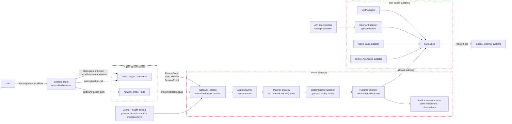

# Design status

This document describes the current gateway design, separating it from ideas that
are still under discussion, points judged technically impossible under the given
constraints, and the main development bottlenecks.

The OSS packaging and commercial operation premises are kept in `business-operations.md`.

## Current Design

The current architecture is an authorization gateway that sits on the agent side.
The agent runtime itself is not modified, but an agent-specific integration layer
forwards task events and tool events to the gateway before any outbound action is
executed.

### Confirmed Architecture

This is the confirmed logical architecture. The hosting choice is deliberately
excluded from this diagram. The gateway may later run on localhost, a user VM, a
private network service, or a managed self-hosted package, but these logical
boundaries should remain stable.



Confirmed implications:

- Each agent may require its own dedicated setup adapter. That is acceptable as
  long as every adapter normalizes to the same gateway event contract.
- The product core of the gateway is not the Claude Code hook. Claude Code is only
  one adapter.
- Network routing is necessary to prevent bypass, but it is not sufficient for
  PAuth enforcement unless prompt events and tool events are also captured.
- Hosting is an operational decision. It must not leak into planner logic,
  enforcement logic, or `SuiteSpec`.
- The gateway must report its own effective protection level. When prompt capture
  or route control is missing, it must not advertise that session as full PAuth
  protection.

Current stable boundaries:

| Boundary | Current contract | Repo anchor |
|---|---|---|
| Agent ingress | `PromptMessage` and `ToolCallMessage` over the gateway message API. | `gateway/ingress/agent_channel.py`, `gateway/serving/http_server.py` |
| Planning | Converts the user prompt and tool schemas into restricted imperative `run()` code. | `gateway/planning/planner.py`, `planning-strategies.md` |
| Validation | The generated code must pass grammar, slicing, and rule compilation before enforcement. | `pauth/grammar.py`, `pauth/pipeline.py`, `pauth/rules.py` |
| Enforcement | Every tool call is checked against the compiled rules and envelope-backed observations. | `pauth/enforcer.py`, `pauth/envelope.py` |
| Tool source | Tool providers are adapted to `SuiteSpec`. | `pauth/suites/base.py`, `gateway/providers/openapi_suite.py`, `gateway/providers/mcp_suite.py` |

Implemented integrations and providers:

- Claude Code hooks are the first ingress adapter, not the product core.
- The shopping suite is a local, deterministic demo suite.
- AgentDojo is used for benchmark/mock environments via
  `tests/experiment/agentdojo_adapter.py`.
- The MCP and OpenAPI providers can be adapted to `SuiteSpec`.
- OpenAPI specs can be reflected into tool schemas, and their changes can be
  monitored.

Implemented planner strategies:

- `deterministic`: the default recognizer for known prompt patterns.
- `llm-freeform`: LLM code generation with grammar-repair retries and optional
  judge support.

Registered but not implemented planner slots:

- `interactive-structuring`
- `specialized-codegen`
- `formal-semantic`

Current protection model (the canonical definition is `ProtectionLevel` in the code
`gateway/runtime/protection.py`; the following is its human-facing mirror):

| Level | Observed by gateway | Claim |
|---|---|---|
| L0 | Network destination only | Coarse firewall. No PAuth guarantee. |
| L1 | Tool calls only | Can reject unknown/out-of-policy tools, but cannot infer task intent. |
| L2 | Clean prompt and tool calls | PAuth plan enforcement begins to have meaning. |
| L3 | Clean prompt and tool calls, plus tools executed by the gateway | The strongest goal currently. |

The product should aim for L3, but when a deployment remains at L0, L1, or L2, that
should be stated explicitly.

## Discussed Improvements

These are plausible improvements, but they are not yet guaranteed and not fully
implemented.

### Localhost Versus Isolated VM

The deployment target is deliberately left undecided. The question to ask is not
"small scale or large scale" but how strongly the agent process needs to be
contained.

There are two candidate modes under discussion:

| Mode | Shape | Strength | Cost |
|---|---|---|---|
| Local adjacent mode | Runs the agent and gateway on the same user machine. The agent adapter sends events to `localhost`. | Low-friction onboarding. Best first OSS experience. | On its own, this cannot prevent all direct network bypass from the agent process. |
| Isolated agent mode | Runs the agent inside a VM/container/sandbox. The agent can only reach the gateway, and the gateway reaches the SaaS/API. | Can contain the agent's external communication more strongly. | Heavy setup. OS/runtime dependent. Requiring it up front could reduce OSS adoption. |

The design question is this:

```text
Should the default OSS experience optimize for low-friction local adoption, or
should the default security story require an isolated agent runtime?
```

Current leaning:

- Keep the logical architecture agent-adjacent.
- Do not make VPC/cloud placement the primary frame.
- Assume `localhost` as the first user experience.
- Treat VM/container/sandbox isolation as the stronger containment mode.
- **Decision (2026-07-08, Q10):** Even on localhost, if the agent is run under a
  **dedicated non-admin user** and OS egress lockdown
  (`gateway/deploy/egress_lockdown.sh`) is applied, **its outbound communication
  necessarily passes through the gateway** (anything that does not is dropped at
  the kernel). Therefore "the route cannot be enforced on localhost" is no longer
  correct — it can be enforced *under the precondition of a non-admin user*. It is
  ineffective for an agent with admin privileges (the rules can be removed), and
  non-network side effects (local FS, etc.) are not covered; these remain the
  advantages of the isolated mode (VM/container).

Main dependencies:

- "OS-level agent privilege management" has been concretized as egress lockdown in
  the form of a **dedicated non-admin user plus a per-user egress firewall** (Q10).
  Restriction to the approved network destination (= the gateway) is achieved this
  way. What remains is FS-side isolation of files/credentials/tools, and health
  checks to detect that it has been disabled.
- Localhost mode therefore relies on egress lockdown (under the non-admin user
  precondition) plus credential isolation plus adapter routing plus health checks
  plus explicit bypass risk reporting. Full process-level containment (down to
  non-network side effects) is still the domain of the isolated mode.

This decision should be revisited when implementing daemon startup, health checks,
and bypass detection. The minimum viable product may first support localhost while
documenting the stronger VM/container mode as the path to strict containment.

### Dual Deployment Development Model

The localhost version and the isolated VM/container version should not be separate
repositories. They are two deployment modes of the same gateway idea. Splitting the
repository would create design drift that could otherwise have been avoided. Planner
behavior, the event contract, enforcement semantics, adapter schemas, and the audit
format would have to be kept in sync by hand.

Recommended structure:

```text
single repository
  shared core:
    pauth/
    gateway planner
    gateway event contract
    SuiteSpec/tool adapters
    audit/envelope semantics

  deployment modes:
    local-adjacent mode
    isolated-agent mode
```

Git worktrees are useful for implementation isolation, but they should be used as
temporary development workspaces, not as a permanent product split.

Recommended worktree policy:

| Worktree | Purpose | Merge rule |
|---|---|---|
| `codex/local-adjacent-mode` | Daemon startup, localhost adapter UX, local health checks. | Keep the event contract and enforcement core shared. |
| `codex/isolated-agent-mode` | VM/container sandbox profiles, gateway-only outbound routes, stronger bypass controls. | Reuse the same gateway protocol and policy engine. |

Do not fork the conceptual model:

- Keep `PromptEvent`, `ToolCallEvent`, and `SessionEvent` shared.
- Keep planner strategies shared.
- Keep PAuth validation and enforcement shared.
- Keep tool adapters shared as much as possible.
- Put deployment-specific code at the edges. Startup scripts, sandbox profiles,
  installer UX, route enforcement, health checks, and so on.

Practical rule: create a worktree only after committing the current design
baseline. Creating a worktree from a dirty working tree branches from a stale
`HEAD` and makes the two modes diverge before implementation even begins.

### Agent-Agnostic Ingress

The gateway should not standardize on a single capture mechanism. It should
standardize on a single event contract.

Expected adapter shapes:

```text
Claude Code hook          ┐
Codex hook/plugin         ├─> PromptEvent / ToolCallEvent / SessionEvent
MCP/session adapter       │
browser/desktop adapter   │
custom agent adapter      ┘
```

This means each agent still needs setup, while the gateway can treat everything
identically after normalization.

Necessary next step: promote the current wire shape of `PromptMessage` and
`ToolCallMessage` into an explicit Gateway Integration Contract that includes
fields such as `session_id`, `source`, `captured_before_model`,
`protection_level`, and bypass/health status.

### More Convenient Setup

The realistically best setup experience is this:

1. Install/enable the agent-specific adapter.
2. Configure the gateway URL.
3. Route registered tool/API calls through the gateway.
4. Confirm via health checks that prompt capture and tool routing are enabled.

Even more convenient variants may be possible:

- A one-command local installer.
- Auto-generated Claude Code hook configuration.
- Packaging of a Codex plugin/connector.
- An MCP proxy mode for agents that already use MCP tools.
- A browser/desktop adapter for agents that have no lifecycle hooks.
- A self-hosted UI to view adapter status, planner mode, and connected SaaS specs.

The convenience layer must not hide the protection level. A smooth setup that
silently degrades to L0 is worse than an explicit setup that tells the user what is
actually being protected.

### Planner Strategy Evolution

The A1 prompt-to-code layer is intentionally made replaceable.

Candidate strategy tracks:

- `interactive-structuring`: asks the user targeted questions, assembles a
  structured prompt, and then generates code.
- `specialized-codegen`: uses a model specialized for restricted imperative code,
  together with validator-driven retries.
- `formal-semantic`: parses controlled natural language into a semantic form, and
  then emits restricted imperative code.

The invariant is that every strategy must still emit restricted `run()` code and
pass deterministic validation. Unless the PAuth core is intentionally redesigned,
no strategy should emit rules directly.

### API Spec Reflection

OpenAPI reflection is implemented as a foundation, but the full user-visible update
loop is not yet started.

Desired future behavior:

1. Detect upstream API spec changes.
2. Present added/removed/changed tools and parameters to the user.
3. Require acceptance or policy review for risky changes.
4. Reload or restart the gateway on the accepted tool surface.
5. Persist the accepted spec version for audit.

Current constraint: the monitor emits diffs, but a running gateway does not yet
hot-reload accepted changes.

## Technically Impossible Under Current Constraints

These points should be treated as rejected claims, not future roadmap items,
unless the constraints change.

### Zero-Setup Universal Agent Support

There is no universal hook standard spanning every agent. If an agent does not
expose prompts, tool calls, or a routable tool boundary, the gateway cannot observe
the data required for PAuth enforcement.

Therefore, this is not a valid claim:

```text
Install the gateway once and it automatically protects every agent with no
agent-specific setup.
```

The defensible claim is this:

```text
For agents with a compatible adapter or routeable tool boundary, the gateway
normalizes prompt/tool events and enforces task-scoped authorization before
SaaS/API execution.
```

### Network Proxy Alone Recovers User Intent

A network proxy can observe the destination, and sometimes the request body. But it
cannot reliably reconstruct the following:

- The clean user prompt before the model's reasoning.
- Meaningful tool names.
- Structured tool arguments.
- Whether that call belongs to the original task or to a goal injected later.

A network-only deployment is L0 unless it is combined with prompt/tool event
capture.

### Complete Safety From Prompt-to-Code Generation

PAuth can enforce the generated plan. But it does not prove that the generated plan
perfectly captures the user's true intent.

Validator retries can prove syntactic validity and validity as a restricted
language. But that alone cannot prove semantic faithfulness. Any message that hints
at "complete safety" is technically false.

### Full Bypass Prevention Without Controlling Execution Routes

If the agent can call SaaS directly, execute arbitrary shell/network commands, or
use an unobserved credential path, the gateway can be bypassed.

The gateway can only enforce actions that pass through an observed and controlled
route.

### Editing Agent Internals As The Default Product Strategy

Forking or modifying a specific agent can be useful for experiments, but it does not
support the product position of agent-agnostic protection. It should be kept as a
last resort or a benchmark technique, and should not be the primary integration
strategy.

## Development Bottlenecks

### 1. Integration Contract Is Not Formal Enough

The code has `PromptMessage` and `ToolCallMessage`, but the product needs a stable
external contract. Without it, every time a new adapter appears it will invent the
details on its own, and the gateway will drift toward agent-specific behavior.

Priority:

1. Define `PromptEvent`, `ToolCallEvent`, `SessionEvent`, and health/bypass events.
2. Version the contract.
3. Add adapter conformance tests.

### 2. Prompt Capture Is The Main Product Risk

The hardest part is not writing yet another proxy. The hard part is capturing the
clean prompt before contamination by model/tool results, across different agents.

If prompt capture is weak, the system falls from L2/L3 to L1/L0, and the core PAuth
claim collapses.

### 3. A1 Intent Faithfulness Is Unsolved

The current deterministic planner has a narrow scope. The current LLM planner can
pass grammar validation even while the intent is lost.

This is the central research bottleneck. Validator success must be measured
separately from intent-faithfulness success.

### 4. Real SaaS State And Credentials Are Not Yet Production-Grade

The demo and benchmark suites are not enough. A real deployment needs the following:

- Credential storage → 🟡 policy decided (S4: adopt a broker); implementation at the
  first real SaaS integration.
- Per-user tool registration → 🔴 not implemented (needs a user model).
- Envelope persistence → ⚪ intentionally non-persistent (session_store saves only
  reconstruction inputs. B1).
- Audit log → 🟢 file persistence implemented (`http_server --audit-log`, JSONL
  append, operator-facing). Rotation/aggregation not done.
- Provider-specific error handling → 🔴 not implemented.
- Safe reload when API specs change → 🔴 not implemented (needs an authenticated
  reload endpoint).

### 5. Bypass And Side-Channel Policy Is Incomplete

Agents like Claude Code can have shell, filesystem, subprocess, and network side
channels. Enforcing tool calls alone cannot cover these channels. **Some of this
was addressed on 2026-07-08 (below).**

The explicit policies the product needs and their current status:

- Allow/deny of shell commands → **🟢 implemented** (`SideChannelPolicy` default-deny,
  S21. But limited to "calls that went through the gateway". Namespaced ones are
  captured too).
- Outbound network restriction → **🟢 implemented** (OS egress lockdown
  `gateway/deploy/egress_lockdown.sh`, Q10. Under the non-admin user precondition,
  forces outbound through the gateway).
- Credential isolation → 🟡 policy decided (S4: adopt a broker); implementation at
  the first real SaaS integration.
- Fallback behavior for unknown tools → 🟢 default-deny (PAuth core).
- Observable health checks → 🟡 implemented (`GET /health` plus `GET /sessions/<id>`
  which returns value-free protection level, whether a plan exists, rule count, and
  pending confirmation count). *Active* detection of disabled hooks / direct SaaS
  calls (heartbeats, etc.) is not implemented.
- **FS-side isolation of non-network side effects (local FS tampering, planting
  secrets)** → 🔴 not implemented (outside the scope of egress lockdown; needs the
  isolated mode or an FS sandbox).

### 6. Evaluation Must Move Beyond Mock Suites

AgentDojo is useful, but it is not enough to validate the product's claims.

The next evaluation layer needs the following:

- A real SaaS API or a realistic SaaS API.
- Multiple agent adapters.
- Setup failure cases.
- Prompt capture ordering tests.
- Bypass attempts.
- Measurement of false positives / false negatives per protection level.

## Immediate Documentation Rule

When updating the architecture documentation, keep these categories separate:

1. **Current design**: what is implemented or directly expressed in the code.
2. **Discussed improvements**: what is plausible but not guaranteed.
3. **Technically impossible**: what is rejected under the current constraints.
4. **Development bottlenecks**: work that blocks the product's claims.

Mixing these categories makes the design look more mature than it is, and leads to
false product claims.
