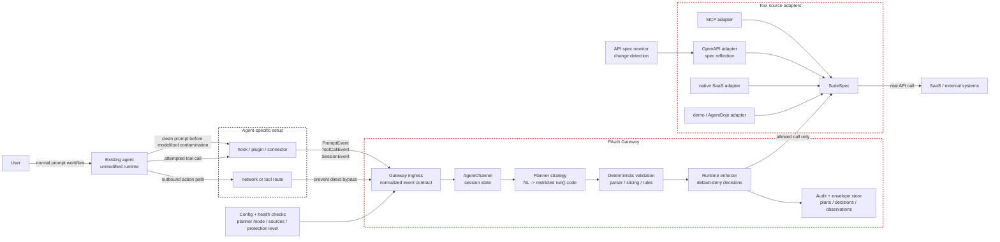

# Design status

This document separates the current gateway design from ideas still under
discussion, points judged technically impossible under the stated constraints,
and the main development bottlenecks.

OSS packaging and commercial operating assumptions live in
`gateway/BUSINESS_OPERATIONS.md`.

## Current Design

The current architecture is an agent-facing authorization gateway. The agent
runtime stays unmodified, but an agent-specific integration forwards task and
tool events to the gateway before outward actions execute.

### Confirmed Architecture

This is the confirmed logical architecture. Hosting choices are deliberately
left out of this diagram: the gateway may later run on localhost, a user VM, a
private network service, or a managed self-hosted package, but these logical
boundaries should remain stable.



Confirmed implications:

- Each agent can require its own setup adapter. That is acceptable as long as
  all adapters normalize into the same gateway event contract.
- The gateway's product core is not the Claude Code hook. Claude Code is one
  adapter.
- Network routing is necessary for bypass prevention, but not sufficient for
  PAuth enforcement unless prompt and tool events are also captured.
- Hosting is an operational decision. It must not leak into planner logic,
  enforcement logic, or `SuiteSpec`.
- The gateway must report its effective protection level. If prompt capture or
  route control is missing, the session must not be marketed as full PAuth
  protection.

Current stable boundaries:

| Boundary | Current contract | Repo anchor |
|---|---|---|
| Agent ingress | `PromptMessage` and `ToolCallMessage` over the gateway message API. | `gateway/agent_channel.py`, `gateway/http_server.py` |
| Planning | User prompt plus tool schemas are converted into restricted imperative `run()` code. | `gateway/planner.py`, `gateway/PLANNING_STRATEGIES.md` |
| Validation | Generated code must pass grammar, slicing, and rule compilation before enforcement. | `pauth/grammar.py`, `pauth/pipeline.py`, `pauth/rules.py` |
| Enforcement | Every tool call is checked against compiled rules and envelope-backed observations. | `pauth/enforcer.py`, `pauth/envelope.py` |
| Tool source | Tool providers adapt into `SuiteSpec`. | `pauth/suites/base.py`, `gateway/openapi_suite.py`, `gateway/mcp_suite.py` |

Implemented integrations and providers:

- Claude Code hooks are the first ingress adapter, not the product core.
- The shopping suite is the local deterministic demo suite.
- AgentDojo is used through `tests/experiment/agentdojo_adapter.py` for
  benchmark/mock environments.
- MCP and OpenAPI providers can be adapted into `SuiteSpec`.
- OpenAPI specs can be reflected into tool schemas and monitored for changes.

Implemented planner strategies:

- `deterministic`: default recognizer for known prompt patterns.
- `llm-freeform`: LLM code generation with grammar repair retries and optional
  judge support.

Registered but unimplemented planner slots:

- `interactive-structuring`
- `specialized-codegen`
- `formal-semantic`

Current protection model:

| Level | Observed by gateway | Claim |
|---|---|---|
| L0 | Network destination only | Coarse firewall; no PAuth guarantee. |
| L1 | Tool call only | Can deny unknown/off-policy tools, but cannot infer task intent. |
| L2 | Clean prompt plus tool call | PAuth plan enforcement becomes meaningful. |
| L3 | Clean prompt plus tool call plus gateway-executed tools | Strongest current target. |

The product should aim for L3, while being explicit when a deployment is only
L0, L1, or L2.

## Discussed Improvements

These are plausible improvements, but they are not yet guaranteed or fully
implemented.

### Localhost Versus Isolated VM

The deployment target is intentionally unresolved. The open question is not
"small scale versus large scale"; it is how strongly the agent process must be
contained.

Two candidate modes are under discussion:

| Mode | Shape | Strength | Cost |
|---|---|---|---|
| Local adjacent mode | Agent and gateway run on the same user machine. Agent adapters send events to `localhost`. | Low-friction adoption; best first OSS experience. | Does not by itself prevent all direct network bypass from the agent process. |
| Isolated agent mode | Agent runs inside a VM/container/sandbox. The agent can only reach the gateway; the gateway reaches SaaS/API. | Stronger containment of the agent's external communication. | Heavier setup; OS/runtime dependent; may reduce OSS adoption if required first. |

The design question is:

```text
Should the default OSS experience optimize for low-friction local adoption, or
should the default security story require an isolated agent runtime?
```

Current leaning:

- Keep the logical architecture agent-adjacent.
- Do not make VPC/cloud placement the main frame.
- Treat `localhost` as the likely first user experience.
- Treat VM/container/sandbox isolation as the stronger containment mode.
- Do not claim that localhost alone guarantees all agent network traffic must
  pass through the gateway.

Key dependency:

- Localhost mode becomes more realistic as OS-level agent permission management
  matures. If the operating system or agent runtime can reliably restrict a
  specific agent process to approved network destinations, credentials, files,
  and tools without affecting other desktop apps, then a localhost gateway can
  provide stronger containment with much lower setup cost.
- Until that exists, localhost mode should rely on credential isolation,
  adapter routing, health checks, and explicit bypass-risk reporting rather
  than claiming complete process-level containment.

This decision should be revisited when implementing daemon startup, health
checks, and bypass detection. The minimum viable product may support localhost
first while documenting the stronger VM/container mode as the path to stricter
containment.

### Dual Deployment Development Model

The localhost version and isolated VM/container version should not become
separate repositories. They are two deployment modes of the same gateway idea.
Splitting repositories would create avoidable design drift: planner behavior,
event contracts, enforcement semantics, adapter schemas, and audit formats
would need to be manually synchronized.

Preferred structure:

```text
single repository
  shared core:
    pauth/
    gateway planner
    gateway event contract
    SuiteSpec/tool adapters
    audit/envelope semantics

  deployment modes:
    local-adjacent mode
    isolated-agent mode
```

Git worktrees are useful for implementation isolation, but they should be used
as temporary development workspaces, not as permanent product splits.

Suggested worktree policy:

| Worktree | Purpose | Merge rule |
|---|---|---|
| `codex/local-adjacent-mode` | Daemon startup, localhost adapter UX, local health checks. | Must keep event contract and enforcement core shared. |
| `codex/isolated-agent-mode` | VM/container sandbox profile, gateway-only outbound route, stronger bypass controls. | Must reuse the same gateway protocol and policy engine. |

Do not fork the conceptual model:

- `PromptEvent`, `ToolCallEvent`, and `SessionEvent` must stay shared.
- Planner strategies must stay shared.
- PAuth validation and enforcement must stay shared.
- Tool adapters must stay shared where possible.
- Deployment-specific code should live at the edge: startup scripts, sandbox
  profiles, installer UX, route enforcement, and health checks.

Practical rule: create worktrees only after the current design baseline is
committed. Creating worktrees from a dirty working tree will branch from an
older `HEAD` and make the two modes diverge before implementation even starts.

### Agent-Agnostic Ingress

The gateway should not standardize on one capture mechanism. It should
standardize on one event contract.

Expected adapter shape:

```text
Claude Code hook          ┐
Codex hook/plugin         ├─> PromptEvent / ToolCallEvent / SessionEvent
MCP/session adapter       │
browser/desktop adapter   │
custom agent adapter      ┘
```

This means each agent still needs setup, but the gateway can treat all of them
the same after normalization.

Required next step: promote the current `PromptMessage` and `ToolCallMessage`
wire shapes into an explicit Gateway Integration Contract, including fields
such as `session_id`, `source`, `captured_before_model`, `protection_level`,
and bypass/health status.

### More Convenient Setup

The best realistic setup experience is:

1. install/enable the agent-specific adapter;
2. set the gateway URL;
3. route registered tools/API calls through the gateway;
4. verify health checks show prompt capture and tool routing are active.

More convenient variants may be possible:

- one-command local installer;
- auto-generated Claude Code hook settings;
- Codex plugin/connector packaging;
- MCP proxy mode for agents that already use MCP tools;
- browser/desktop adapter for agents without lifecycle hooks;
- self-hosted UI for adapter status, planner mode, and connected SaaS specs.

The convenience layer must not hide the protection level. A smooth setup that
silently degrades to L0 is worse than an explicit setup that tells the user what
is actually protected.

### Planner Strategy Evolution

The A1 prompt-to-code layer is intentionally replaceable.

Candidate strategy tracks:

- `interactive-structuring`: ask the user targeted questions, build a
  structured prompt, then generate code.
- `specialized-codegen`: use a model specialized for restricted imperative
  code, with validator-driven retries.
- `formal-semantic`: parse controlled natural language into semantic forms,
  then emit restricted imperative code.

The invariant is that every strategy must still emit restricted `run()` code
and pass through deterministic validation. No strategy should emit rules
directly unless the PAuth core is deliberately redesigned.

### API Spec Reflection

OpenAPI reflection is implemented as a foundation, but the full user-facing
update loop is still open.

Desired future behavior:

1. detect an upstream API spec change;
2. show the user added/removed/changed tools and parameters;
3. require acceptance or policy review for risky changes;
4. reload or restart the gateway with the accepted tool surface;
5. persist the accepted spec version for audit.

Current limitation: the monitor emits a diff, but a running gateway does not
yet hot-reload accepted changes.

## Technically Impossible Under Current Constraints

These points should be treated as rejected claims, not future roadmap items,
unless the constraints change.

### Zero-Setup Universal Agent Support

There is no universal hook standard across all agents. If an agent does not
expose prompts, tool calls, or a routeable tool boundary, the gateway cannot
observe the data needed for PAuth enforcement.

Therefore this is not a valid claim:

```text
Install the gateway once and it automatically protects every agent with no
agent-specific setup.
```

The defensible claim is:

```text
For agents with a compatible adapter or routeable tool boundary, the gateway
normalizes prompt/tool events and enforces task-scoped authorization before
SaaS/API execution.
```

### Network Proxy Alone Recovers User Intent

A network proxy can observe destinations and sometimes request bodies. It
cannot reliably recover:

- the clean user prompt before model reasoning;
- semantic tool names;
- structured tool arguments;
- whether the call belongs to the original task or a later injected goal.

Network-only deployment is L0 unless paired with prompt/tool event capture.

### Complete Safety From Prompt-to-Code Generation

PAuth can enforce a generated plan. It does not prove the generated plan
perfectly captures the user's real intent.

Validator retries can prove syntax and restricted-language validity. They
cannot prove semantic faithfulness by themselves. Any messaging that implies
"perfect safety" is technically false.

### Full Bypass Prevention Without Controlling Execution Routes

If the agent can call the SaaS directly, run arbitrary shell/network commands,
or use an unobserved credential path, the gateway can be bypassed.

The gateway can only enforce actions that pass through an observed and
controlled route.

### Editing Agent Internals As The Default Product Strategy

Forking or modifying a specific agent can be useful for experiments, but it
does not support the product position of agent-agnostic protection. It should
remain a last resort or benchmark technique, not the main integration strategy.

## Development Bottlenecks

### 1. Integration Contract Is Not Formal Enough

The code has `PromptMessage` and `ToolCallMessage`, but the product needs a
stable external contract. Without that, every new adapter will invent details
and the gateway will drift toward agent-specific behavior.

Priority:

1. define `PromptEvent`, `ToolCallEvent`, `SessionEvent`, and health/bypass
   events;
2. version the contract;
3. add adapter conformance tests.

### 2. Prompt Capture Is The Main Product Risk

The hardest part is not writing another proxy. The hard part is capturing the
clean prompt before model/tool-result contamination across different agents.

If prompt capture is weak, the system drops from L2/L3 to L1/L0 and the core
PAuth claim collapses.

### 3. A1 Intent Faithfulness Is Unsolved

The current deterministic planner is narrow. The current LLM planner can pass
grammar validation while still losing intent.

This is the central research bottleneck. Validator success must be measured
separately from intent-faithfulness success.

### 4. Real SaaS State And Credentials Are Not Yet Production-Grade

The demo and benchmark suites are not enough. Real deployments need:

- credential storage;
- per-user tool registration;
- envelope persistence;
- audit logs;
- provider-specific error handling;
- safe reload when API specs change.

### 5. Bypass And Side-Channel Policy Is Incomplete

Claude Code-like agents can have shell, filesystem, subprocess, and network
side channels. Tool-call enforcement alone does not cover those channels.

The product needs explicit policy for:

- shell command allow/deny;
- outbound network restrictions;
- credential isolation;
- unknown tool fallback behavior;
- health checks that detect disabled hooks or direct SaaS calls.

### 6. Evaluation Must Move Beyond Mock Suites

AgentDojo is useful, but it is not enough to validate the product claim.

The next evaluation layer needs:

- real or realistic SaaS APIs;
- multiple agent adapters;
- setup failure cases;
- prompt capture ordering tests;
- bypass attempts;
- false positive and false negative measurement per protection level.

## Immediate Documentation Rule

When updating architecture docs, keep these categories separate:

1. **Current design**: implemented or directly represented in code.
2. **Discussed improvements**: plausible but not guaranteed.
3. **Technically impossible**: rejected under current constraints.
4. **Development bottlenecks**: work that blocks the product claim.

Mixing these categories makes the design look more mature than it is and will
lead to bad product claims.
